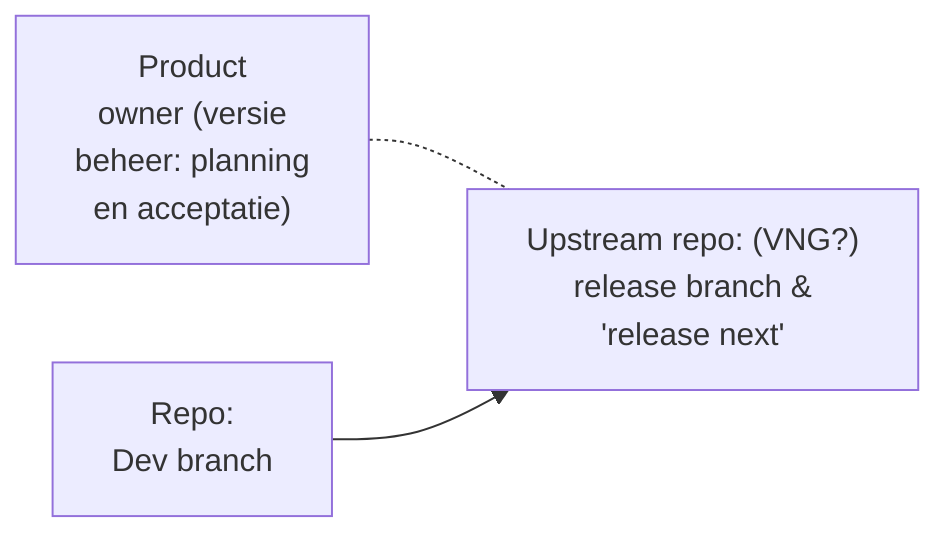
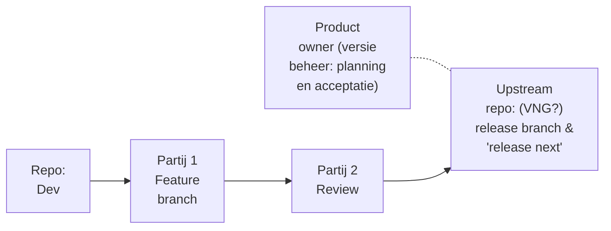
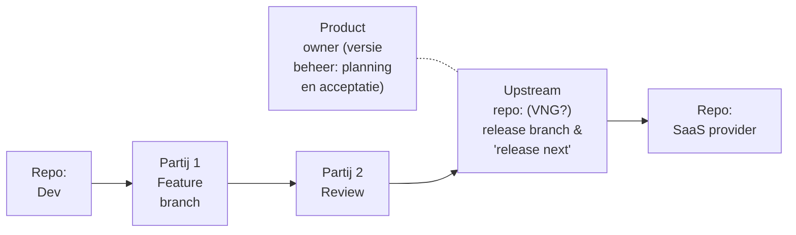

# Inkoop richtlijnen OpenZaak

Dit document bevat inkooprichtlijnen voor OpenZaak, met met de intentie op regie vanuit landelijke voorziening.

## Inhoudsopgave
* TOC
{:toc}

##  Inleiding

Hieronder staan conceptteksten die gebruikt kunnen worden om OpenZaak onder de regie van landelijke voorziening te brengen.

## Conceptbestand Governance.md

@todo add text for governance.md

## Ecosysteembeschrijvingen voor OpenZaak

Drie stappen voor het ecosysteem om volledige regie bij de landelijke voorziening te bereiken

### Huidige staat: een marktpartij die verantwoordelijk is

### Tussen staat: een marktpartij die verantwoordelijk is, geassisteerd door een review partij

### Beoogde staat: volle regie vanuit landenlijke voorziening

## Text op te nemen in contract

@todo - turn into folders?

### Generiek

### Staat 1

### Staat 2

### Staat 3