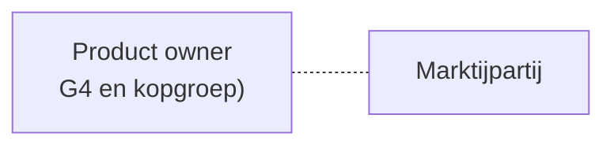
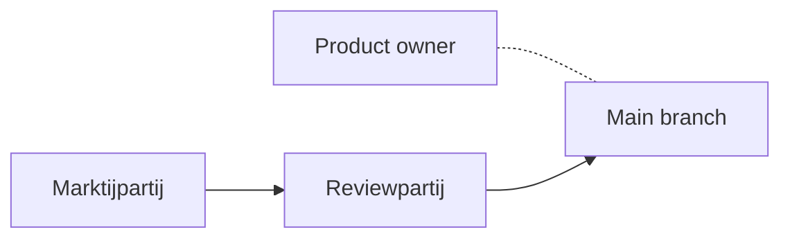
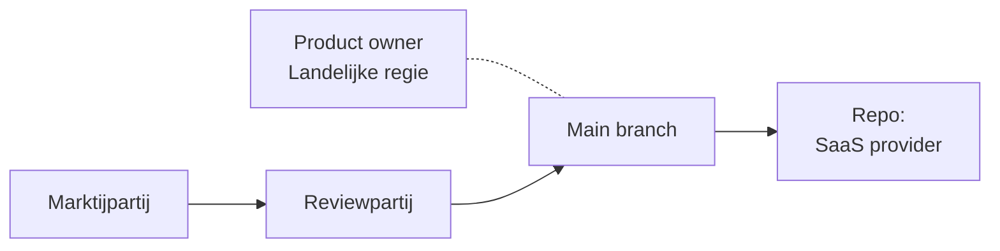

# Inkoop richtlijnen OpenZaak

Dit document bevat inkooprichtlijnen voor OpenZaak, met met de intentie op regie vanuit landelijke voorziening.

## Inhoudsopgave
* TOC
{:toc}

##  Inleiding

Hieronder staan conceptteksten die gebruikt kunnen worden om OpenZaak onder de regie van landelijke voorziening te brengen.

## Ecosysteembeschrijvingen voor OpenZaak

Drie stappen voor het ecosysteem om volledige regie bij de landelijke voorziening te bereiken

### Huidige staat: een marktpartij die verantwoordelijk is

### Tussen staat: een marktpartij die verantwoordelijk is, geassisteerd door een review partij

### Beoogde staat: volle regie vanuit landenlijke voorziening

## Text op te nemen in contract en governance.md

@todo - turn into folders per staat?

### Generiek

De algemene voorwaarden van de GIBIT zijn van toepassing.

De algemene voorwaarden van de Common Ground-principes zijn van toepassing. Deze zijn te verkrijgen via [insert link].

De huidige staat van dit ecosysteem is te vinden in [repo/governance.md].

### Staat 1

### Staat 2

### Staat 3

