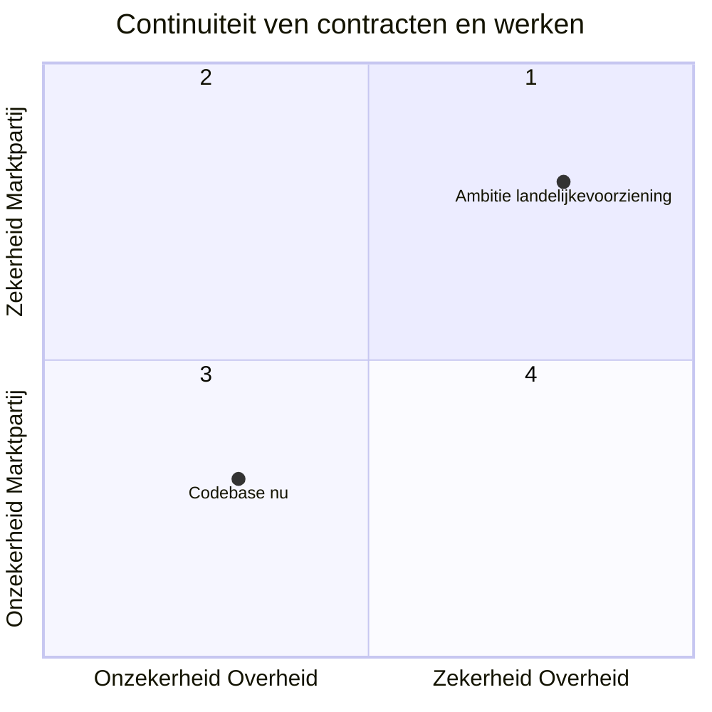
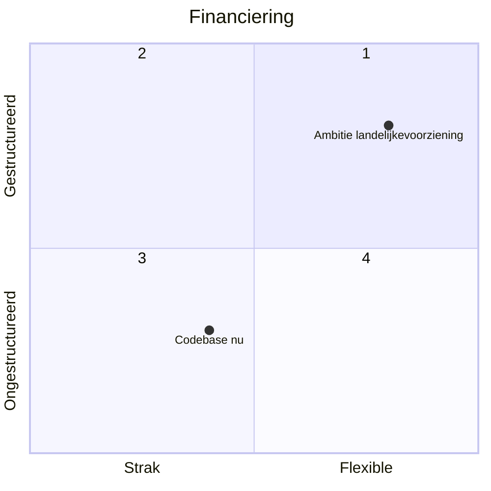
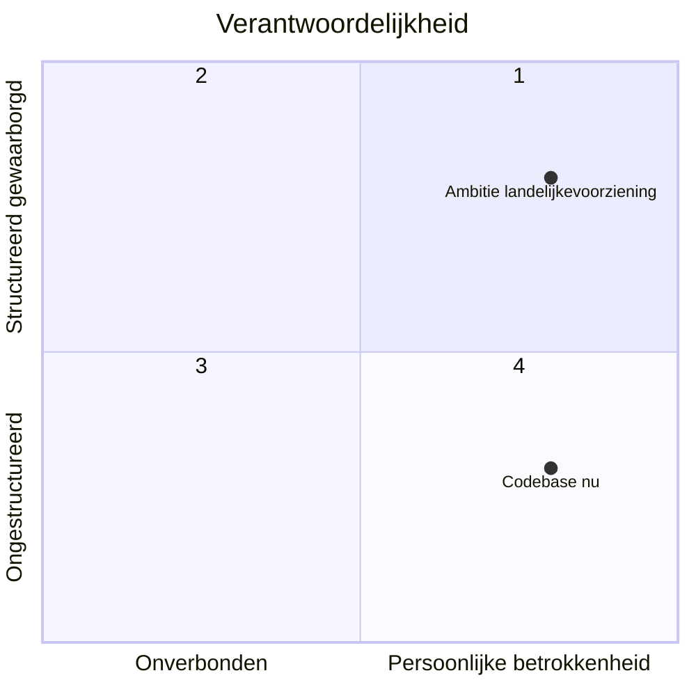
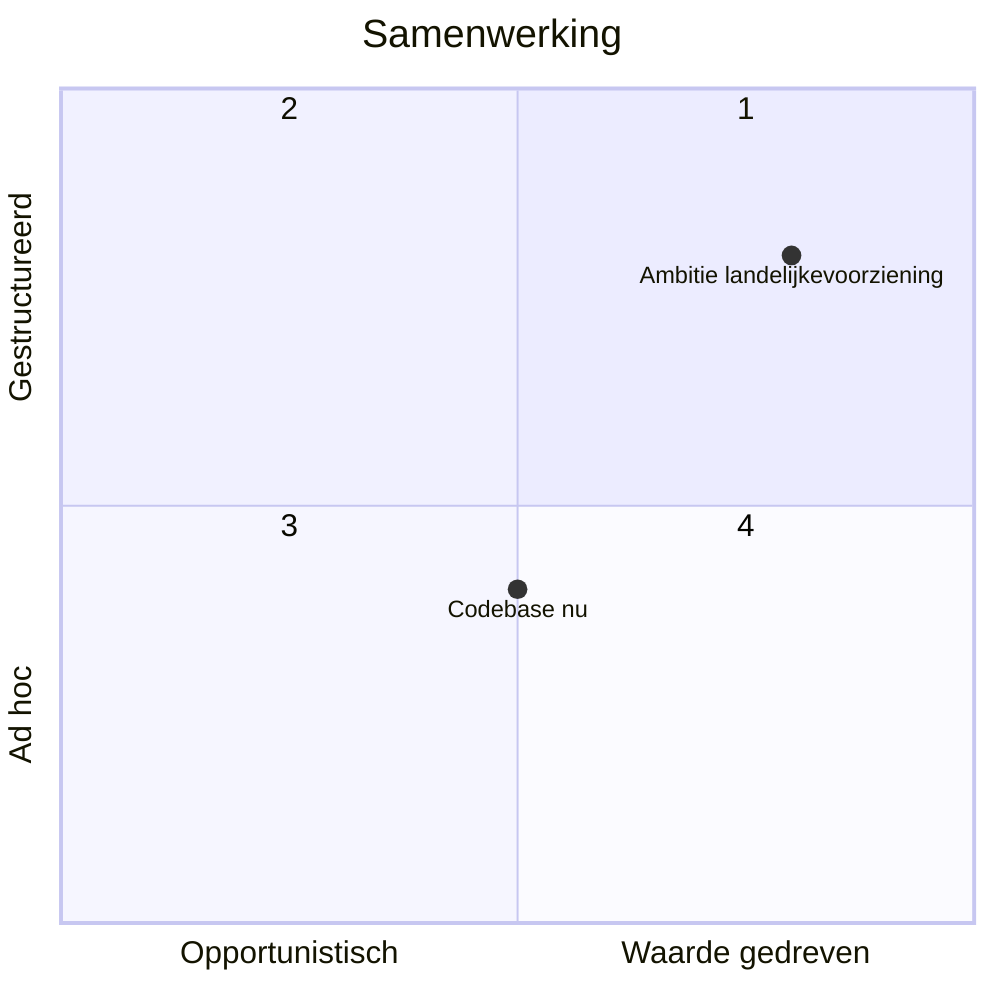

# Templates voor stewardship report

## Strategisch belang?

Wat is het strategisch belang van de codebase?

## Bedrijfszekerheidsfactor

### Continuiteit 

Hoe belangrijk is het de continuiteit voor de overheid?

> bvb - bepaalde uptime? kan het makkelijk worden vervangen door een andere codebase of marktpartij? hoe veel zou dit kosten/welke risicos brengt het mee?

Hoe belangrijk is de continuiteit van de marktpartij?

> bvb - is het belangrijk dat die zelvde marktij altijd het zelvde team heeft klaar staan? verwachten we regelmatig werk dat snel gedaan moet worden? zouden vertragingen bij nieuwe features een probleem zijn? hoeveel specialisatie kennis is er, en is het makkelijk om nieuwe developers met warme kennis te vinden?

### Financiering 

Hoe strak is de financiering rondom de codebase?

### Verantwoordelijkheid 

Op welke wijze wordt verantwoordelijkheid voor de codebase geborgd?

### Samenwerking tussen community 

Hoe werkt de community samen?

