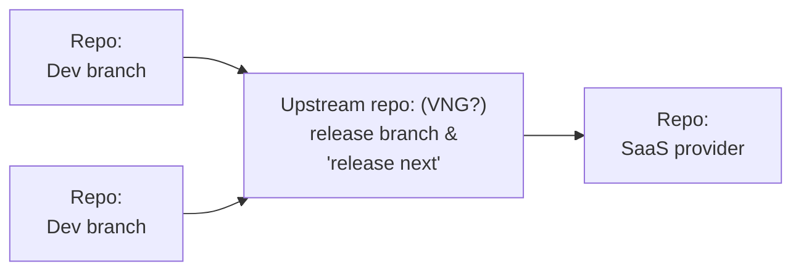

## Inhoudsopgave
* TOC
{:toc}

## Rollen & verantwoordelijkheden 

### Ecosysteem/codebase steward

- Collectief product ownerschap  
- Portfolio management op alle componenten (en samenhang daartussen)  
- Product release management met duideljike roadmap, documentatie en release management

### Beheer

- maintenance en bug fixes

### Uitgeven

- upstream repository, (stable) releaes van code, documentatie
- publicatie en archief 
- change log, dependency graph, central issue en bug tracker 
- communicatie van release dates, breaking changes, critical issue

### Reviewen

- quality assurance
- audit (security, tests, documents, Q&A)
- works with feature development party 

### Development

- new features
- works with review party 

### Implementeren

- local implementations
- repots bugs, issues, needs
- optionally with local changes

### Leveren

- SaaS
- repots bugs, issues, needs
- optionally with local changes

## Rollen & contracten

### Ecosysteem/codebase steward

Intern vanuit landelijke regie, of gedelegeerd 

### Beheer

Maintenance contract

### Uitgeven

Intern vanuit landelijke regie, of gedelegeerd

### Reviewen

Review contract

### Development

Feature development contract

### Implementeren

Implemetatie contract

### Leveren

SaaS contract

## Rollen, contracten en verantwoordelijkhedem

| Rollen                     | Verantwoordelijkheden                                                                                  | Contract type                          |
|-----------------------------|--------------------------------------------------------------------------------------------------------|----------------------------------------|
| Ecosysteem/codebase steward | - Collectief product ownerschap - Portfolio management op alle componenten (en samenhang daartussen) - Product release management met duidelijke roadmap, documentatie en release management | Intern vanuit landelijke regie, of gedelegeerd |
| Beheer                      | - Maintenance en bug fixes                                                                               | Maintenance contract                     |
| Uitgeven                    | - Upstream repository, (stable) releases van code, documentatie - Publicatie en archief - Change log, dependency graph, central issue en bug tracker - Communicatie van release dates, breaking changes, critical issue | Intern vanuit landelijke regie, of gedelegeerd |
| Reviewen                    | - Quality assurance - Audit (security, tests, documents, Q&A) - Works with feature development party       | Review contract                          |
| Development                 | - New features - Works with review party                                                                | Feature development contract             |
| Implementeren               | - Local implementations - Repots bugs, issues, needs - Optionally with local changes                       | Implementatie contract                   |
| Leveren                     | - SaaS - Repots bugs, issues, needs - Optionally with local changes                                       | SaaS contract                            |

## Repo structure

## Dual vendorship

## Stappenplan voor de introductie van een tweede marktpartij

0. Contract voor "close easy issue"  
1. Review contract  
2. Maintenance contract  
3. Feature development contract  

## Marktpartijen 

