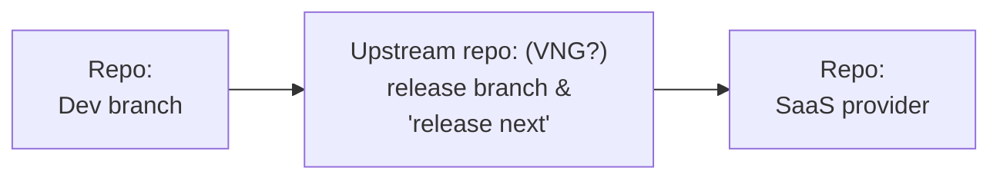

# Verslag: Governance, Ecosysteem en Rollen

Status: Draft

De huidige OpenZaak community werkt goed voor snel en informeel werken.
Naarmate OpenZaak groeit en breder wordt ingezet, kan de community veranderen.

Gezien de ambitie om van OpenZaak een kerncomponent te maken die op landelijk niveau onder centrale regie wordt geëxploiteerd, kunnen stappen worden gezet om de bedrijfszekerheid van de community te versterken.

Op basis van de interviews, workshops en bedrijfszekerheidsdoelen schetst onderstaand document een visie voor de community, de repo-structuur en de relaties tussen marktpartijen.

## Context: huidige governance- en werkafspraken

Er is veel informele samenwerking binnen de community, inclusief documentatie met een informeel karakter. 
De G4 vervult een aansturende rol.
Er is veel goodwill en de meeste betrokken partijen zijn tevreden.

Tegelijkertijd wordt een regie-organisatie in het vooruitzicht gesteld.
Er is ook de ambitie om zaken beter te borgen — niet uit wantrouwen, maar om de algehele robuustheid te vergroten.

## Voorstel: rollen & verantwoordelijkheden

### Ecosysteem/codebase steward

Het ophalen van problemen en wensen met betrekking tot de doorontwikkeling van de component en het coördineren van de doorontwikkeling op basis van de afgesproken governance, om de verschillende belangen in balans te houden, tussen aanbieders en afnemers, en tussen bijv. grote en kleine gemeenten, etc.

- Collectief product ownerschap met duidelijke roadmap  
- Portfolio management op alle componenten (en samenhang daartussen)  
- Regie over marktpartijen en samenwerking tussen marktpartijen
- Community managememt

### Beheer

Onderhoud van versies

- maintenance en bug fixes

### Uitgeven

Langetermijn beschikbaar stellen van component(versies).
Op orde en compliant houden van de opensourcecode van de component(versies).

- Product release management met documentatie 
- upstream repository, (stable) releaes van code, documentatie
- publicatie en archief 
- change log, dependency graph, central issue en bug tracker 
- communicatie van release dates, breaking changes, critical issue
- acceptatie van feature pull request
- installatiehandleiding
- beheershandleiding
- gebruikshandleiding
- regelmatige publicatie van versies

### Reviewen

Controleren van de gepubliceerde versies van de component.
Dit in het kader van vier ogen principe én warme kennis bij meer dan één partij.

- quality assurance
- audit (security, tests, documents, Q&A)
- works with feature development party 

### Development

Projectmatig ontwikkelen van een component of een feature van een component.

- new features
- works with review party
- aanbieden aan beheerder als pull request

### Implementeren

Het inrichten van de instantie van de component voor specifiek gebruik bij een gemeente, het trainen van medewerkers en het beantwoorden van vragen.
 
- local implementations, configuratie, training, helpdesk
- repots bugs, issues, needs
- optionally with local changes

### Leveren

Het leveren van een draaiende instantie van de component.

- SaaS
- repots bugs, issues, needs
- optionally with local changes

## Voorstel: Rollen & contracten - wie doet wat?

### Ecosysteem/codebase steward

Nu: G4 overleg

Toekomst: Intern vanuit landelijke regie, of gedelegeerd 

### Beheer

Nu: Maykin, als onderdeel van een featurecontract

Toekomst: Maykin met een specifiek onderhoudscontract, mogelijk tweede marktpartij met een specifiek onderhoudscontract

### Uitgeven

Nu: Maykin

Toekomst: Intern vanuit landelijke regie, of gedelegeerd

### Reviewen

Nu: Maykin

Toekmost: Mogelijk tweede marktpartij met een review contract

### Development

Nu: Maykin

Toekmost: Mogelijk tweede marktpartij met een feature development contract

### Implementeren

Nu:

Toekmost: 

### Leveren

Nu: Verschillende SaaS aanbieders

Toekmost: SaaS aanbieder onder landelijke regie

## Rollen, contracten en verantwoordelijkhedem

| Rollen                     | Verantwoordelijkheden                                                                                  | Contract type                          |
|-----------------------------|--------------------------------------------------------------------------------------------------------|----------------------------------------|
| Ecosysteem/codebase steward | - Collectief product ownerschap - Portfolio management op alle componenten (en samenhang daartussen) - Product release management met duidelijke roadmap, documentatie en release management | Intern vanuit landelijke regie, of gedelegeerd |
| Beheer                      | - Maintenance en bug fixes                                                                               | Maintenance contract                     |
| Uitgeven                    | - Upstream repository, (stable) releases van code, documentatie - Publicatie en archief - Change log, dependency graph, central issue en bug tracker - Communicatie van release dates, breaking changes, critical issue | Intern vanuit landelijke regie, of gedelegeerd |
| Reviewen                    | - Quality assurance - Audit (security, tests, documents, Q&A) - Works with feature development party       | Review contract                          |
| Development                 | - New features - Works with review party                                                                | Feature development contract             |
| Implementeren               | - Local implementations - Repots bugs, issues, needs - Optionally with local changes                       | Implementatie contract                   |
| Leveren                     | - SaaS - Repots bugs, issues, needs - Optionally with local changes                                       | SaaS contract                            |

## Voorbeeld repo structuur: splitsen van development en upstream uitgeven

## Voorbeeld scenario: dual vendorship

## Stappenplan voor de introductie van een tweede marktpartij

0. Contract voor "close easy issue"  
1. Review contract  
2. Maintenance contract  
3. Feature development contract  

## Voorbeeld scenario: marktpartijen met elk 1 development en 1 review verantwoordelijkheid

