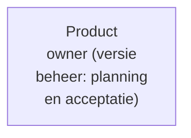
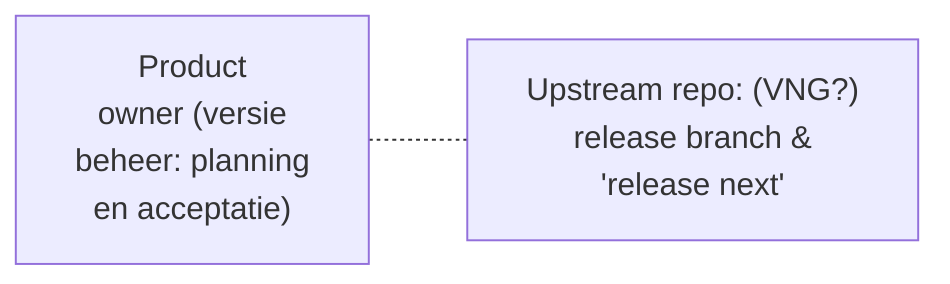
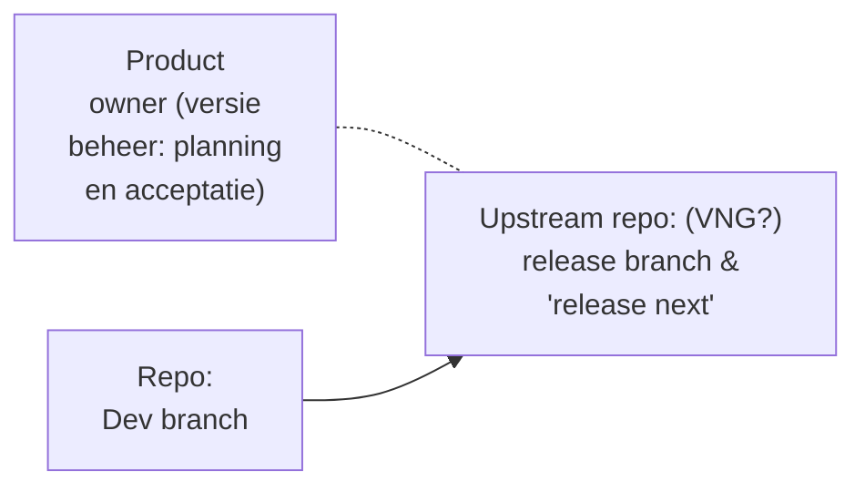
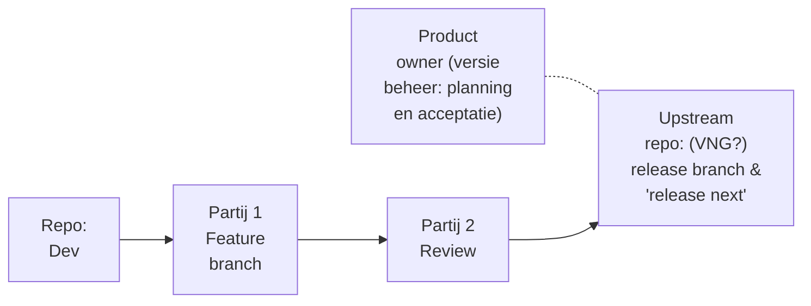
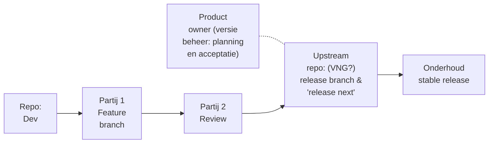
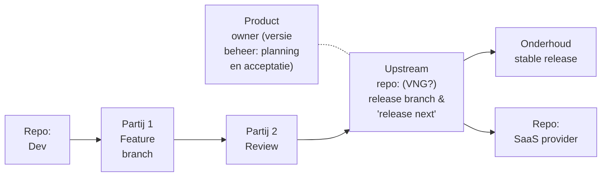
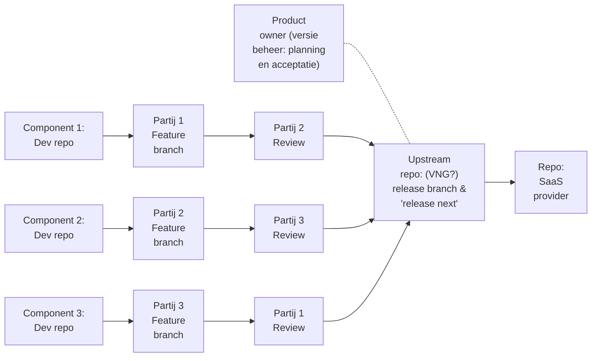
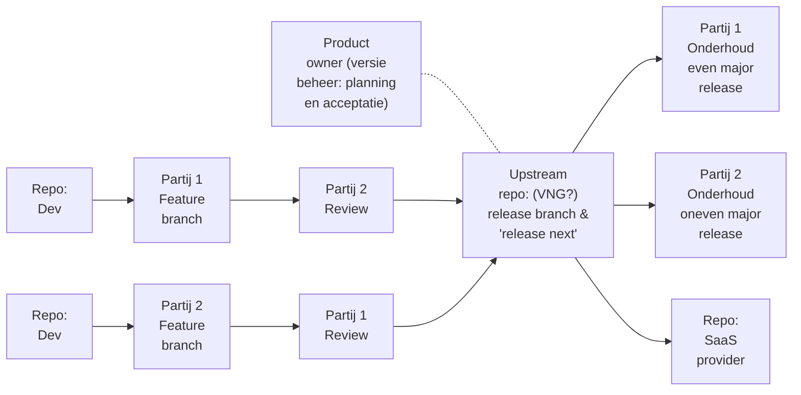

# Duidelijke rollen

Op basis van de interviews, workshops en bedrijfszekerheidsdoelen, schetst dit document een visie voor de community, de repo-structuur en de relaties tussen marktpartijen.

Het doel is om voor te bereiden dat meerdere marktpartijen kunnen bijdragen, indien en wanneer dit gewenst of vereist is door de G4 en.of landelijke regie.

## Inhoudsopgave
* TOC
{:toc}

## Inleiding: huidige governance- en werkafspraken

De huidige OpenZaak community werkt goed voor snel en informeel werken.

Er is veel informele samenwerking binnen de community, inclusief documentatie met een informeel karakter. 
De G4 vervult een aansturende rol.
Er is veel goodwill en de meeste betrokken partijen zijn tevreden.

Naarmate OpenZaak groeit en breder wordt ingezet, kan de community veranderen.

Gezien de ambitie om van OpenZaak een kerncomponent te maken die op landelijk niveau onder centrale regie wordt geëxploiteerd, kunnen stappen worden gezet om de bedrijfszekerheid van de community te versterken.

## Voorstel: rollen & verantwoordelijkheden

### Ecosysteem/codebase steward

Nu: G4 overleg

Toekomst: Intern vanuit landelijke regie, of gedelegeerd 

#### Rol

Het ophalen van problemen en wensen met betrekking tot de doorontwikkeling van de component en het coördineren van de doorontwikkeling op basis van de afgesproken governance, om de verschillende belangen in balans te houden, tussen aanbieders en afnemers, en tussen bijv. grote en kleine gemeenten, etc.

- Collectief product ownerschap met duidelijke roadmap, doel & scope, architectuurprincipes, standaarden, lifecycle and compatibility etc  
- Portfolio management op alle componenten, incl samenhang en configuratie tussen versies daarvan  
- Regie over marktpartijen en samenwerking tussen marktpartijen
- Community managememt, incl open-source governance, bijdrageprocessen, besluitvorming, rolzuiverheid, kenniscontinuïteit en bedrijfszekerheid 
- Ecosysteem management, incl afweging tussen stabiliteit, innovatie, onafhankelijkheid en beheerkosten
- Financiering en opdrachtgeverschap 

#### Waarom? (design choices)

*  Dit is een landschap met meerdere componenten, dus er moet vanuit landelijke regie toezicht zijn op de onderlinge afhankelijkheden tussen de verschillende componenten.

### Uitgeven

Nu: Maykin

Toekomst: Intern vanuit landelijke regie, of gedelegeerd

#### Rol

Langetermijn beschikbaar stellen van component(versies).
Op orde en compliant houden van de opensourcecode van de component(versies).

- Upstream repository met publicatie en archief van alle (stable) releases van code
- Central issue en bug tracker, acceptatie van feature pull request   
- Product release management met documentatie
  - communicatie van release dates, breaking changes, critical issues
  - change log, dependency graph
  - installatie-, beheers, en gebruiks-handleiding

#### Waarom? (design choices)

*  Een centrale repository, in eigendom en beheer van de landelijke regie, met alle (stabiele) versies van alle componenten, maakt beter toezicht en betere regie mogelijk.

### Development

Nu: Maykin

Toekmost: Mogelijk tweede marktpartij met een feature development contract, indien nodig/gewenst

#### Rol

Projectmatig ontwikkelen van een component of een feature van een component.

- Code contributies (new features of patches) met alle bijhorende documentatie en tests 
- Aanbieden aan beheerder als pull request
- Werkt mogelijk samen met een review party

#### Waarom?

*  Levering aan de centrale repository, onder toezicht van de steward, maakt een duidelijke definitie van “done” en het beheer van features/versies mogelijk.

### Reviewen

Nu: Maykin

Toekmost: Mogelijk tweede marktpartij met een review contract

#### Rol

Samenwerken met de development partij door contributies naar de publicatie repo te reviewen. 
Dit in het kader van vier ogen principe én warme kennis bij meer dan één partij.

- Onafhankelijke review (code, security, documentatie, herbruikbaarheid, etc)

#### Waarom?

*  De introductie van een tweede beoordelingspartij zorgt voor meer veerkracht in het ecosysteem, waarbij een tweede partij over warme kennis van de codebase beschikt.

### Maintenance/onderhoud

Nu: Maykin, als onderdeel van een featurecontract

Toekomst: Maykin met een specifiek onderhoudscontract, mogelijk tweede marktpartij met een specifiek onderhoudscontract

#### Rol

Onderhoud van een of meerdere stable release versies van de code, incl bug fixes, updates en security patches. 

#### Waarom?

*  Indien gewenst, zou de tweede beoordelingspartij op termijn ook het beheer van de codebase kunnen doen (bijvoorbeeld bij elke andere stabiele release) om zo nog meer kennis van de codebase op te bouwen.

### Leveren (SaaS)

Nu: Verschillende SaaS aanbieders

Toekmost: SaaS aanbieder onder landelijke regie

#### Rol

Het leveren van stable releases uit de publicatie repo als een draaiende instantie van de component.

- Levert eindproducten als SaaS-dienst
- Verantwoordelijkheid voor performance, schaalbaarheid, capaciteit van de diensten
- Monitoring, incidentmanagement, back-ups, herstel en dagelijkse operationele beveiliging
- Inbrengen bugs, issues, requirements terug naar de centrale issue tracker

#### Waarom?

* Een aparte SaaS-aanbieder om de kwaliteit van de codebase, de uitvoerbaarheid door andere partijen, en daarmee de veerkracht van het ecosysteem te waarborgen.

### Implementeren

#### Rol

Het inrichten van de instantie van de component voor specifiek gebruik bij een gemeente, het trainen van medewerkers en het beantwoorden van vragen.
 
- Aanpassen van werkprocessen, configuraties en werkwijzen zodat de SaaS-diensten aansluiten op de dagelijkse praktijk
- Brengen ervaringen, knelpunten en behoeften van gebruikers terug naar het ecosysteem ter verbetering van productdefinitie, adoptie en dienstverlening
    
## Voorbeeld scenario: marktpartijen met elk 1 development en 1 review verantwoordelijkheid

Doel: meerdere ontwikkelpartijen laten bijdragen aan een landelijke regie-repository, waarbij elke partij verantwoordelijk is voor de ontwikkeling van één component en de review van één component.

## Voorbeeld scenario: dual vendorship

Doel: twee ontwikkelpartijen laten samenwerken om elkaars werk te ontwikkelen en te reviewen.

### Stappenplan voor de introductie van een tweede marktpartij

0. Contract voor "close easy issue": de codebase en documentatie leren kennen  
1. Reviewcontract: een diepgaander begrip van de codebase krijgen en gecoacht worden door de hoofdontwikkelende partij  
2. Maintenance contract: verantwoordelijkheid nemen voor de codebase door een stabiele release te onderhouden  
3. Feature-ontwikkelcontract: deelnemen aan de ontwikkeling van de codebase
