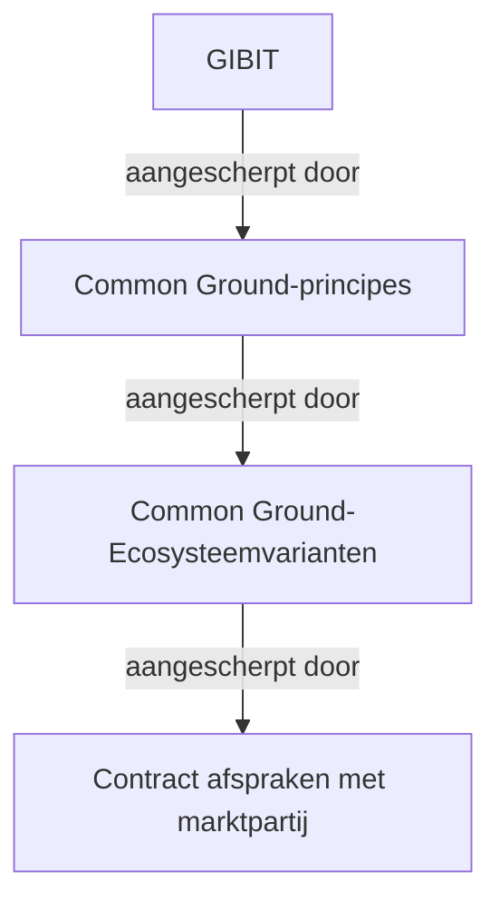

# Richtlijnen voor inkoop

Dit document bevat input voor inkooprichtlijnen voor OpenZaak.

## Inhoudsopgave
* TOC
{:toc}

## Inleiding

Bij de inkoop rond OpenZaak spelen meerdere beslissingslagen een rol.

Een logische werkwijze lijkt om te verwijzen naar de GIBIT, daarnaast een Common Ground-document te hebben met principes en ecosysteemvarianten, en vervolgens een beknopt contract met de leverancier dat naar deze voorgaande lagen verwijst.

## De GIBIT 

De GIBIT is bewust breed opgezet om toepasbaar te zijn op alle IT-inkopen. Open source wordt wel genoemd, maar beperkt uitgewerkt. Dit is begrijpelijk, omdat zo flexibiliteit behouden blijft, afhankelijk van het type open source en de context van toepassing.

Hiervoor bestaat al een tool die contractteksten kan genereren en jaarlijks wordt geactualiseerd.

## Generieke Common Ground-principes

Het lijkt nuttig aanvullende documentatie op te stellen voor open source zoals uitgevoerd onder landelijke regie / Common Ground. Dit kan onderdeel zijn van het Standaard Governance Model (SGM) (zie "Samenwerkingsprincipes Platform Dienstverlening").

Deze aanvullende documentatie kan onder meer bevatten:  
- algemene richtlijnen voor governance binnen communities  
- specificaties over de repository waar code moet worden aangeleverd  
- een eenduidige definitie van “done”  
- engineering- en ontwerprichtlijnen zoals gehanteerd door de landelijke regie  
- welke standaardterminologie wordt gebruikt  
  
Dit zijn afspraken die richtinggevend zijn, maar niet vaak zouden moeten veranderen. Te verwijzen als organiserende principes in een centraal beheerd document.

## Beschrijving van Common Ground-Ecosysteemvarianten

Daarbovenop komt het ecosysteem rond een specifieke codebase (bijvoorbeeld één leverancier, meerdere leveranciers, aparte reviewpartijen, etc.).

In de ecosysteembeschrijving wordt beschreven welke rollen er bestaan en welke taken/verantwoordelijkheden bij welke rol belegd zijn.
Dit is het niveau dat onregelmatig verandert, namelijk wanneer de communitystructuur of het belang van de codebase daarom vraagt.

De definitie van een beperkt aantal gestandaardiseerde ‘staten’ voor codebases en hun governance helpt met: 
- overzicht te houden  
- governance eenduidig toe te passen  
- standaardprocedures uit te voeren  
- het ecosysteem te ontwikkelen zonder bestaande contracten te veranderen

Zo wordt voorkomen dat iedere codebase of ieder contract een eigen afwijkende governance ontwikkelt.

Deze staten kunnen centraal worden beschreven, vastgesteld en beheerd door de codebase steward vanuit landelijke regie.

> Voorbeeldsituatie:
> Er is een overeenkomst met één leverancier voor vier jaar om als enige partij aan een codebase te werken. Na twee jaar groeit de codebase zodanig dat een tweede reviewpartij gewenst is. Dat moet mogelijk zijn zonder het oorspronkelijke contract te wijzigen.
>In het contract staat dan bijvoorbeeld:
> “De leverancier vervult deze rol, die zich momenteel in staat A bevindt en kan doorgroeien naar staat B.”

## Contract afspraken met marktpartij

Het contract met een individuele leverancier blijft vervolgens:

- Kort  
- Rolgericht  
- Verwijzend naar de geldende kaders en de huidige “staat” van de codebase  

## Voorgestelde documentstructuur

Deze aanpak leidt tot een heldere scheiding van lagen:

- GIBIT-tool → genereert het juridische contractsjabloon  
- Landelijke regie → centraal online document met  
  - algemene werkafspraken  
  - werkafspraken per ‘staat’  
- Contract → één beknopt document per marktpartij  
- ‘Staat’ van de codebase → vastgelegd als bestand in de repository  

Zo ontstaat een modulair systeem waarin juridische stabiliteit en organisatorische flexibiliteit goed samengaan.

## Mogelijke text op te nemen in contract en governance.md

De algemene voorwaarden van de GIBIT zijn van toepassing.
Deze zijn te verkrijgen via [insert link].

De algemene voorwaarden van de Common Ground-principes zijn van toepassing.
Deze zijn te verkrijgen via [insert link].

De Common Ground-ecosysteeemprincipes zijn van toepassing. 
De huidige staat van dit ecosysteem is te vinden in [repo/governance.md].

## Beheer van texten

Common Ground-Ecosysteemvarianten (en/of beschrijving per codebase) zouden kunnen worden vastgelegd in een tooltje waarvan contract texten kunnen worden geexporteerd.

Prototype: [https://www.jgroenen.nl/teksten-tool/](https://www.jgroenen.nl/teksten-tool/
)

## Openstaande vraag

Zijn er verschillende teksten nodig voor verschillende fasen (bijv. marktconsultatie, aanbesteding, contractering, codebase documentatie), of volstaat één set teksten die in alle fasen hergebruikt kan worden? Of zelfs één document waarnaar in alle fasen verwezen kan worden?
