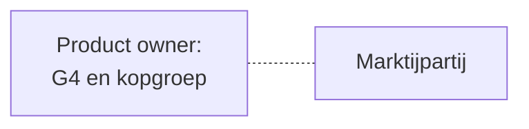
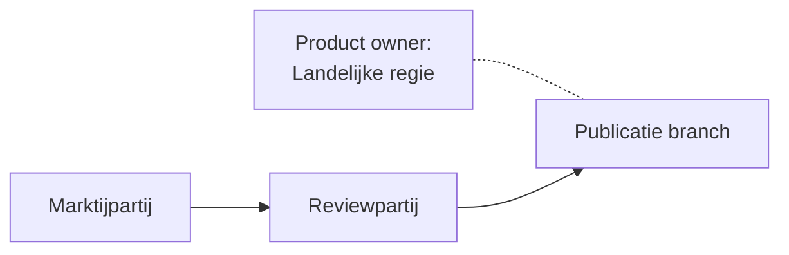
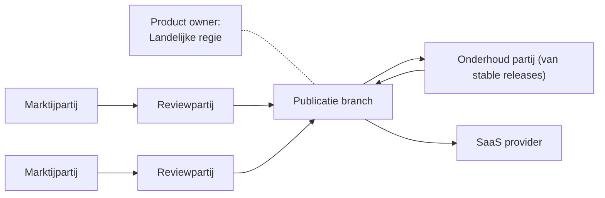

# Stappen voor OpenZaak ecosysteem 

Status: Draft

Dit document bevat mogelijke beoogde stappen voor de OpenZaak ecosysteem, met de intentie op regie vanuit landelijke voorziening.

## Inhoudsopgave
* TOC
{:toc}

## Ecosysteembeschrijvingen voor OpenZaak

Drie stappen voor het ecosysteem om volledige regie bij de landelijke voorziening te bereiken

### Huidige staat: een marktpartij die verantwoordelijk is

### Tussen staat: landelijke regie verantwoordelijk voor de publicatie van stable releases, een marktpartij verantwoordelijk voor de development en onderhoud van de code, geassisteerd door een review partij

### Beoogde staat: volle regie vanuit landenlijke voorziening met mogelijkheid (indien gewenst) voor verschillende development, review, SaaS- en onderhoud-partijen 

## Rollen en taken per staat

