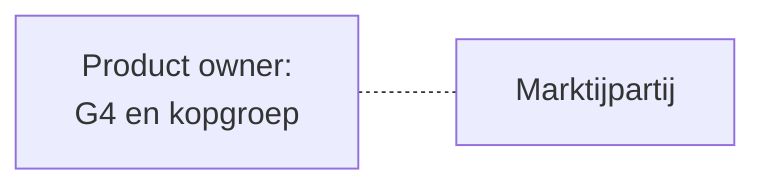
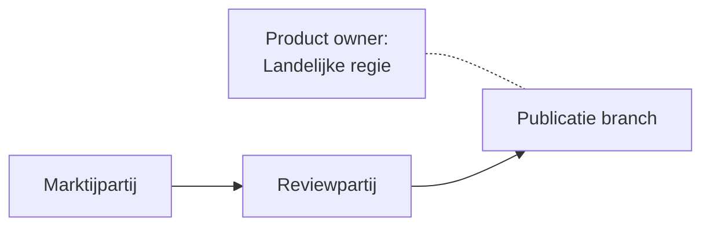

# Stappen voor OpenZaak ecosysteem 

Status: Draft

Dit document bevat mogelijke beoogde stappen die de huidige community leden kunnen maken om regie vanuit landelijke voorziening voor te bereiden.

## Inhoudsopgave
* TOC
{:toc}

## Huidige staat

Een marktpartij die verantwoordelijk is, aangestuurd door de G4

```mermaid
graph LR
    %% Nodes
    Dev1["Marktijpartij"]
    PO["Product owner:<br/>G4 en kopgroep"]

    %% Connections
    PO -.- Dev1 
```

## Te maken stappen

landelijke regie verantwoordelijk voor de publicatie van stable releases
een marktpartij verantwoordelijk voor de development en onderhoud van de code
geassisteerd door een review partij

```mermaid
graph LR
    %% Nodes
    Dev1["Marktijpartij"]
    ReviewP2["Reviewpartij"]
    Upstream["Publicatie branch"]
    PO["Product owner:<br/>Landelijke regie"]

    %% Connections
    PO -.- Upstream
    Dev1 --> ReviewP2
    ReviewP2 --> Upstream
```

### Stappenplan voor de introductie van een tweede marktpartij

0. Contract voor "close easy issue": de codebase en documentatie leren kennen  
1. Reviewcontract: een diepgaander begrip van de codebase krijgen en gecoacht worden door de hoofdontwikkelende partij  
2. Maintenance contract: verantwoordelijkheid nemen voor de codebase door een stabiele release te onderhouden  
3. Feature-ontwikkelcontract: deelnemen aan de ontwikkeling van de codebase
