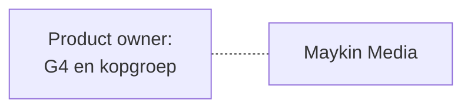

# Stappen voor OpenZaak ecosysteem 

Status: Draft

Dit document bevat mogelijke beoogde stappen die de huidige community leden kunnen maken om regie vanuit landelijke voorziening voor te bereiden.

## Inhoudsopgave
* TOC
{:toc}

## Huidige staat

Een marktpartij die verantwoordelijk is, aangestuurd door de G4

```mermaid
graph LR
    %% Nodes
    Dev1["Maykin Media"]
    PO["Product owner:<br/>G4 en kopgroep"]

    %% Connections
    PO -.- Dev1 
```

## Beoogde staat

Een marktpartij die verantwoordelijk is, aangestuurd door de landeljike regie, met een landelijke-gestuurde SaaS aanbieder, en locale implementatiepartijen. 

```mermaid
graph LR
    subgraph OpenZaak
    %% Nodes
        Dev["Maykin Media ontwikkelt feature in eigen repo"]
        Up["Landelijke regie beheert versie branches in upstream repo"]
        Maint["Maykin Media onderhoudt stable release branches in upstream repo"]
        SaaS["SaaS aanbieder levert draaiende instantie (vanuit eigen repo)"]

        %% Connections
        Dev --"push naar feature branch"--> Up
        Maint --> Up
        Up --> SaaS
    end

    %% Nodes
    Regie["Landelijke regie stuurt ontwikkeling en release management, faciliteert samenwerking tussen marktpartijen, en houdt toezicht op de kwaliteit van de codebase en het ecosysteem"]
    Impl["Implementatiepartij implementeert OpenZaak bij gemeente"]

    %% Connections
    Regie --> OpenZaak
    OpenZaak --> Impl
```

## Iteratief te maken stappen

1) Creatie Github organisatie onder beheer van landelijke regie, overdracht van de OpenZaak repository naar deze organisatie
2) Onderhoud contract vanuit landelijke regie om structureel, noodzakelijk werk te borgen 
3) Definitie van verantwoordelijkheden landelijke regie en Maykin Media incl website en niet feature-gerelateerde documentatie
4) Aanpassingen aan governance file en contracten

### (verplaatst) Stappenplan voor de introductie van een tweede marktpartij

0. Contract voor "close easy issue": de codebase en documentatie leren kennen  
1. Reviewcontract: een diepgaander begrip van de codebase krijgen en gecoacht worden door de hoofdontwikkelende partij  
2. Maintenance contract: verantwoordelijkheid nemen voor de codebase door een stabiele release te onderhouden  
3. Feature-ontwikkelcontract: deelnemen aan de ontwikkeling van de codebase

