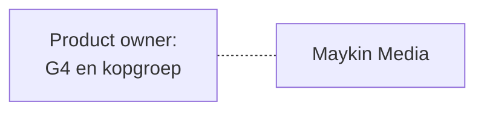
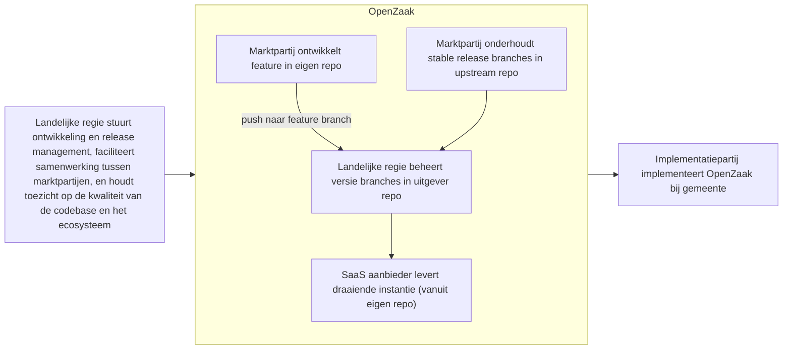

# Stappen voor OpenZaak ecosysteem 

Status: Draft

Dit document bevat mogelijke beoogde stappen die de huidige community leden kunnen maken om regie vanuit landelijke voorziening voor te bereiden.

## Inhoudsopgave
* TOC
{:toc}

## Huidige staat

Een marktpartij die verantwoordelijk is, aangestuurd door de G4

```mermaid
graph LR
    %% Nodes
    Dev1["Maykin Media"]
    PO["Product owner:<br/>G4 en kopgroep"]

    %% Connections
    PO -.- Dev1 
```

## Beoogde staat

Een marktpartij die verantwoordelijk is, aangestuurd door de landeljike regie, met een landelijke-gestuurde SaaS aanbieder, en locale implementatiepartijen. 

```mermaid
graph LR
    subgraph OpenZaak
    %% Nodes
        Dev["Marktpartij ontwikkelt feature in eigen repo"]
        Up["Landelijke regie beheert versie branches in uitgever repo"]
        Maint["Marktpartij onderhoudt stable release branches in upstream repo"]
        SaaS["SaaS aanbieder levert draaiende instantie (vanuit eigen repo)"]

        %% Connections
        Dev --"push naar feature branch"--> Up
        Maint --> Up
        Up --> SaaS
    end

    %% Nodes
    Regie["Landelijke regie stuurt ontwikkeling en release management, faciliteert samenwerking tussen marktpartijen, en houdt toezicht op de kwaliteit van de codebase en het ecosysteem"]
    Impl["Implementatiepartij implementeert OpenZaak bij gemeente"]

    %% Connections
    Regie --> OpenZaak
    OpenZaak --> Impl
```

## Te maken stappen

Proof of concept pilot vanuit landelijke regie om `uitgever`, `onderhoud` en `regie` rollen te testen en verder uit te werken.

1) Uitwerken van voorstel voor `uitgever`, `onderhoud` en `regie` rollen incl test scenarios (huidge pilot?)

2) Contract vanuit landelijke regie om `uitgever` en `onderhoud` in te brengen in huidige werkwijze
   * apparte mensen en uren registratie om processfrictie en cost in kaart te brengen
   * iteratief verbeteren op voorstel (bvb taken verschuiven)
   * bijhouden van test scenarios die voorkomen in praktijk
   * bijhouden van welke verantwoordelijkheden bij `regie` horen 

3) Downstream VNG repo op zetten om process & kosten in kaart te brengen (bvb infra) en `regie` rol verder uit te werken

4) Uitgewerkt model delen met community voor feedback, en dan verwerken tot inkoopcontracten en aanbesteding

## Test scenarios 

Prioriteit:
1) Ontiwkkelen van een nieuwe feature*
2) Security report via de github repo*

Later uit te werken:
3) Feature release (major and minor) 
4) Nieuwe versie van de VNG standaard
5) Dependabot issue gemaakt van common vulnerability exploit (automatic)
6) Wens vanuit andere overheidsorgaan (bvb Logius)
7) Wens vanuit andere gemeente voor locaal versnellen
9) Wens vanuit de regie organisatie
10) Bug/issue reported op de github
11) Patch release met bug fixes
12) Security release 
13) Pull request van buitenaf
14) Issue vanuit test suite voor dependencies tussen componenten

