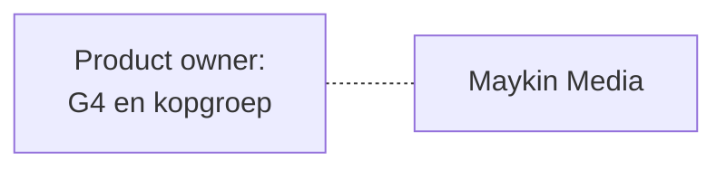
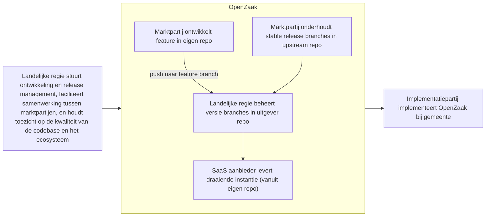

# Stappen voor OpenZaak ecosysteem 

Status: Draft

Dit document bevat mogelijke beoogde stappen die de huidige community leden kunnen maken om regie vanuit landelijke voorziening voor te bereiden.

## Inhoudsopgave
* TOC
{:toc}

## Huidige staat

Een marktpartij die verantwoordelijk is, aangestuurd door de G4


```mermaid
graph LR
    %% Nodes
    Dev1["Maykin Media"]
    PO["Product owner:<br/>G4 en kopgroep"]

    %% Connections
    PO -.- Dev1 
```

## Beoogde staat

Een marktpartij die verantwoordelijk is, aangestuurd door de landeljike regie, met een landelijke-gestuurde SaaS aanbieder, en locale implementatiepartijen. 


```mermaid
graph LR
    subgraph OpenZaak
    %% Nodes
        Dev["Marktpartij ontwikkelt feature in eigen repo"]
        Up["Landelijke regie beheert versie branches in uitgever repo"]
        Maint["Marktpartij onderhoudt stable release branches in upstream repo"]
        SaaS["SaaS aanbieder levert draaiende instantie (vanuit eigen repo)"]

        %% Connections
        Dev --"push naar feature branch"--> Up
        Maint --> Up
        Up --> SaaS
    end

    %% Nodes
    Regie["Landelijke regie stuurt ontwikkeling en release management, faciliteert samenwerking tussen marktpartijen, en houdt toezicht op de kwaliteit van de codebase en het ecosysteem"]
    Impl["Implementatiepartij implementeert OpenZaak bij gemeente"]

    %% Connections
    Regie --> OpenZaak
    OpenZaak --> Impl
```

## Te maken stappen

1) Proof of concept pilot om `uitgever` en `onderhoud` rollen uit te werken  
2) Opzetten van VNG repo (downstream) om process & kosten in kaart te brengen (bvb infra) en `regie` rol verder uit te werken  
3) Uitgewerkt model delen met community voor feedback, en dan verwerken tot inkoopcontracten en een aanbesteding  

## Proof of concept pilot `uitgever` en `onderhoud` rollen

### Doel proof of concept pilot 

Contract vanuit landelijke regie om binnen de huidge werkwijze de `uitgever` en `onderhoud` rollen in te brengen, incl:
   * apparte mensen en uren registratie om processfrictie en kosten in kaart te brengen
   * iteratief verbeteren op voorstel `uitgever` en `onderhoud` (bvb taken verschuiven, toevoegen verwijderen)
   * bijhouden inzichten wanneer test scenarios voorkomen in de praktijk
   * bijhouden welke bijkomende verantwoordelijkheden van `regie` verwacht worden

### Hypothese rollen

#### Uitgever

Vanuit Informatieblad bijdragen voor broncodebeheer 2026:

```
2) zorg dragen voor de beschikbaarheid van de broncode en images (momenteel op Github en DockerHub),  
4) een openbare issue-tracker bijhouden die mogelijke bugs en suggesties van iedereen accepteert,  
10) relevante documentatie bijhouden en openbaar beschikbaar maken,  
11) community contributies aan de open source codebase verwelkomen,  
12) community contributies ("pull requests") monitoren op kwaliteit, veiligheid, herbruikbaarheid en architecturale fit,  
13) community contributie richtlijnen opstellen en onderhouden,  
14) zorg dragen dat alle bijdragen voldoen aan de licentievoorwaarden van de Europese Unie Publieke Licentie (EUPL) versie 1.2 of hoger,  
15) een versie controlemechanisme voor productcode onderhouden,  
16) versiebeheer toepassen (Productversies en ondersteuning),  
17) openbaar beschikbare release-notes bijhouden om o.a. gebruikers te helpen bij het upgraden,  
18) openbare mailinglijst bijhouden waarop gebruikers geïnformeerd worden over releases en relevant nieuws rondom het product,  
19) een compatibiliteitsmatrix bijhouden om devops- en implementatie-ontwikkelaars te ondersteunen bij hun werk,  
20) nieuwe gebruikers op weg helpen door gemakkelijk toegankelijke, eenvoudig te gebruiken voorbeelden beschikbaar hebben,  
22) actief meewerken om het product compliant te maken en houden met de relevante en toepasselijke standaarden,  
23) het 'VNG groeipact' onderschrijven en bijdragen bij aan verbeteringen van VNG-standaarden,  
25) inzetten om volledig compliant te zijn en blijven met de Standard for Public Code,  
26) indien van toepassing, de Applicatie TPM-verklaring beschikbaar te stellen aan Broncodebeheerpartner, en deze – indien nodig, tegen kosten – op naam te laten zetten.
```

Bijkomende:

* Communiceren van release dates, breaking changes en critical issues naar relevante stakeholders  
* Het archiveren van alle stabiele releases van de broncode en images, zodat eerdere versies beschikbaar blijven  

#### Onderhoud

Vanuit Informatieblad bijdragen voor broncodebeheer 2026:

```
3) minimaal dagelijks image en code beveiligingsscans uitvoeren en bevindingen oplossen,  
5) een responsible disclosure programma onderhouden, inclusief een e-mailadres voor beveiligingsproblemen,  
6) CVE's publiceren voor gevalideerde beveiligingsproblemen,  
7) gerapporteerde bugs valideren en beoordelen op prioriteit,  
8) gevalideerde en geprioriteerde bugs oplossen in patch-releases,  
9) koppelingen compatible houden met patches en minor versiewijzigingen in het betreffende koppelvlak (major versiewijzigingen vallen expliciet onder doorontwikkeling),  
19) streven naar backwards compatibiliteit in kleine releases en daarmee installatie/implementatie-upgrades vereenvoudigen,  
21) geschikte Helm charts publiceren voor het product,  
22) een CI pipeline onderhouden inclusief geautomatiseerde testen met een testcoverage van 80% of hoger, teneinde de kwaliteit te waarborgen,  
24) gebruikte componenten van derden ('afhankelijkheden' of 'software bibliotheken') bijhouden, beoordelen op kwaliteit, veiligheid, volwassenheid en naleving van de open source-licenties,  
25) zorg dragen voor compatibiliteit met de meest recente, grote, browsers,
```

Bijkomende:

* Monitoren van afgesproken aantal stable releases op bugs, security en performance issues
* Documenteren van van onderhoudsactiviteiten voor relevante stakeholders

#### Regie

Vanuit Informatieblad bijdragen voor broncodebeheer 2026:

```
1) invulling geven aan het team dat de werkzaamheden uitvoert,  
24) minimaal eenmaal per jaar een bijeenkomst te organiseren voor alle broncodebeheerpartners die meedoen aan het broncodebeheer voor het product,
```

Bijkomende:

* beschikbaar stellen van financiering en opdrachtgeverschap voor de uitgever- en onderhoudsrol,  
* bewaken van de roadmap, scope en architectuurprincipes van het product,  
* coördineren van de samenhang tussen componenten binnen het Common Ground landschap,  
* faciliteren van samenwerking tussen marktpartijen die bijdragen aan het ecosysteem,  
* toezicht houden op de kwaliteit van de codebase en het ecosysteem,  
* borgen van kenniscontinuïteit en bedrijfszekerheid binnen de community,  
* beheren van de centrale upstream repository onder landelijke regie,  
* beschikbaar stellen en onderhouden van de benodigde infrastructuur voor de centrale repository,  
* beheren van toegangsrechten en permissies op de centrale repository,  
* zorgen voor de continuïteit en beschikbaarheid van de centrale repository en bijbehorende infrastructuur,  
* minimaal eenmaal per jaar een bijeenkomst organiseren voor alle partners die meedoen aan het product,

### Test scenarios

Prioriteit:  
1) Ontiwkkelen van een nieuwe feature*  
2) Security report via de github repo*  

Later uit te werken:  
1) Feature release (major and minor)  
2) Nieuwe versie van de VNG standaard  
3) Dependabot issue gemaakt van common vulnerability exploit (automatic)  
4) Wens vanuit andere overheidsorgaan (bvb Logius)  
5) Wens vanuit andere gemeente voor locaal versnellen  
6) Wens vanuit de regie organisatie  
7)  Bug/issue reported op de github  
8)  Patch release met bug fixes  
9)  Security release  
10) Pull request van buitenaf  
11) Issue vanuit test suite voor dependencies tussen componenten

#### Ontiwkkelen van een nieuwe feature


| Stap | Regie | Uitgever | Onderhoud |
|------|-------|----------|-----------|
| 1 | stelt financiering en opdracht beschikbaar voor de feature | — | — |
| 2 | bewaakt scope en architectuurprincipes; keurt feature goed voor roadmap | — | — |
| 3 | — | — | beoordeelt impact op bestaande stable releases en backwards compatibiliteit |
| 4 | — | accepteert en reviewt pull request op kwaliteit, veiligheid, herbruikbaarheid en architecturale fit | — |
| 5 | — | verwerkt goedgekeurde feature in een nieuwe versietak; past versiebeheer toe | — |
| 6 | — | publiceert release-notes en communiceert release naar mailinglijst | — |
| 7 | — | werkt documentatie en compatibiliteitsmatrix bij | — |
| 8 | — | — | rolt CI pipeline en geautomatiseerde testen uit op nieuwe release |

#### Security report via de github repo

| Stap | Regie | Uitgever | Onderhoud |
|------|-------|----------|-----------|
| 1 | — | ontvangt melding via responsible disclosure e-mailadres of issue tracker | — |
| 2 | wordt geïnformeerd over ernst en scope van het beveiligingsprobleem | — | voert dagelijkse beveiligingsscan uit; identificeert of bevestigt het probleem |
| 3 | beslist over prioriteit en urgentie in overleg met uitgever en onderhoud | — | — |
| 4 | — | — | valideert en reproduced het beveiligingsprobleem; beoordeelt prioriteit |
| 5 | — | — | ontwikkelt en test de security patch |
| 6 | — | — | levert patch aan als pull request aan de uitgever |
| 7 | — | reviewt en accepteert de patch; verwerkt in een patch release | — |
| 8 | — | publiceert CVE; communiceert security release naar mailinglijst en relevante stakeholders | — |
| 9 | — | archiveert de gepatchte release in de centrale repository | — |
| 10 | — | — | monitort stable releases na de patch op eventuele verdere issues |

## Opzeteten VNG repo


## Inkoopcontracten en aanbesteding 


