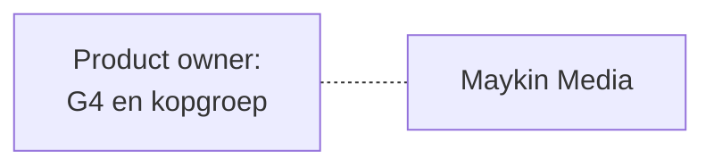
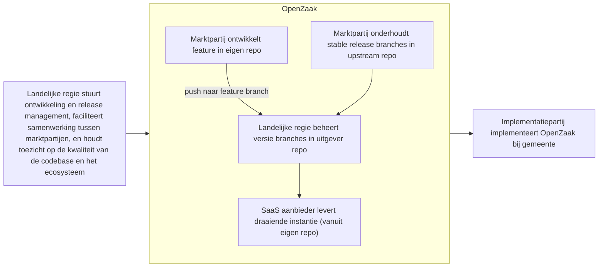

# Stappen voor OpenZaak ecosysteem 

Status: Draft

Dit document bevat mogelijke beoogde stappen die de huidige community leden kunnen maken om regie vanuit landelijke voorziening voor te bereiden.

## Inhoudsopgave
* TOC
{:toc}

## Huidige staat

Een marktpartij die verantwoordelijk is, aangestuurd door de G4

```mermaid
graph LR
    %% Nodes
    Dev1["Maykin Media"]
    PO["Product owner:<br/>G4 en kopgroep"]

    %% Connections
    PO -.- Dev1 
```

## Beoogde staat

Een marktpartij die verantwoordelijk is, aangestuurd door de landeljike regie, met een landelijke-gestuurde SaaS aanbieder, en locale implementatiepartijen. 

```mermaid
graph LR
    subgraph OpenZaak
    %% Nodes
        Dev["Marktpartij ontwikkelt feature in eigen repo"]
        Up["Landelijke regie beheert versie branches in uitgever repo"]
        Maint["Marktpartij onderhoudt stable release branches in upstream repo"]
        SaaS["SaaS aanbieder levert draaiende instantie (vanuit eigen repo)"]

        %% Connections
        Dev --"push naar feature branch"--> Up
        Maint --> Up
        Up --> SaaS
    end

    %% Nodes
    Regie["Landelijke regie stuurt ontwikkeling en release management, faciliteert samenwerking tussen marktpartijen, en houdt toezicht op de kwaliteit van de codebase en het ecosysteem"]
    Impl["Implementatiepartij implementeert OpenZaak bij gemeente"]

    %% Connections
    Regie --> OpenZaak
    OpenZaak --> Impl
```

## Te maken stappen

1) Proof of concept pilot om `uitgever` en `onderhoud` rollen uit te werken
2) Opzetten van VNG repo (downstream) om process & kosten in kaart te brengen (bvb infra) en `regie` rol verder uit te werken
3) Uitgewerkt model delen met community voor feedback, en dan verwerken tot inkoopcontracten en een aanbesteding

## Proof of concept pilot `uitgever` en `onderhoud` rollen

### Proof of concept pilot 

Contract vanuit landelijke regie om binnen de huidge werkwijze de `uitgever` en `onderhoud` rollen in te brengen, incl:
   * apparte mensen en uren registratie om processfrictie en kosten in kaart te brengen
   * iteratief verbeteren op voorstel `uitgever` en `onderhoud` (bvb taken verschuiven, toevoegen verwijderen)
   * bijhouden van inzichten wanneer test scenarios voorkomen in de praktijk
   * bijhouden van welke bijkomende verantwoordelijkheden van `regie` verwacht worden

### Hypothese rollen

#### `uitgever`

Vanuit `Informatieblad bijdragen voor broncodebeheer 2026`:

2) zorg dragen voor de beschikbaarheid van de broncode en images (momenteel op
   Github en DockerHub),
4) een openbare issue-tracker bijhouden die mogelijke bugs en suggesties van iedereen
   accepteert,
10) relevante documentatie bijhouden en openbaar beschikbaar maken,
11) community contributies aan de open source codebase verwelkomen,
12) community contributies ("pull requests") monitoren op kwaliteit, veiligheid, herbruikbaarheid en architecturale fit,
13) community contributie richtlijnen opstellen en onderhouden,
14) zorg dragen dat alle bijdragen voldoen aan de licentievoorwaarden van de Europese Unie Publieke Licentie (EUPL) versie 1.2 of hoger,
15) een versie controlemechanisme voor productcode onderhouden,
16) versiebeheer toepassen (Productversies en ondersteuning),
17) openbaar beschikbare release-notes bijhouden om o.a. gebruikers te helpen bij het upgraden,
18) openbare mailinglijst bijhouden waarop gebruikers geïnformeerd worden over releases en relevant nieuws rondom het product,
19) een compatibiliteitsmatrix bijhouden om devops- en implementatie-ontwikkelaars te ondersteunen bij hun werk,
20) nieuwe gebruikers op weg helpen door gemakkelijk toegankelijke, eenvoudig te gebruiken voorbeelden beschikbaar hebben,
22) actief meewerken om het product compliant te maken en houden met de relevante en toepasselijke standaarden,
23) het 'VNG groeipact' onderschrijven en bijdragen bij aan verbeteringen van VNG-standaarden,
25) inzetten om volledig compliant te zijn en blijven met de Standard for Public Code,
26) indien van toepassing, de Applicatie TPM-verklaring beschikbaar te stellen aan Broncodebeheerpartner, en deze – indien nodig, tegen kosten – op naam te laten zetten.

Bijkomende:

*

#### `onderhoud`

Vanuit `Informatieblad bijdragen voor broncodebeheer 2026`:

1) invulling geven aan het team dat de werkzaamheden uitvoert,
3) minimaal dagelijks image en code beveiligingsscans uitvoeren en bevindingenoplossen,
5) een responsible disclosure programma onderhouden, inclusief een e-mailadres voorbeveiligingsproblemen,
6) CVE's publiceren voor gevalideerde beveiligingsproblemen,
7) gerapporteerde bugs valideren en beoordelen op prioriteit,
8) gevalideerde en geprioriteerde bugs oplossen in patch-releases,
9) koppelingen compatible houden met patches en minor versiewijzigingen in hetbetreffende koppelvlak (major versiewijzigingen vallen expliciet onderdoorontwikkeling),
19) streven naar backwards compatibiliteit in kleine releases en daarmeeinstallatie/implementatie-upgrades vereenvoudigen,
21) geschikte Helm charts publiceren voor het product,
22) een CI pipeline onderhouden inclusief geautomatiseerde testen met eentestcoverage van 80% of hoger, teneinde de kwaliteit te waarborgen,
24) gebruikte componenten van derden ('afhankelijkheden' of 'software bibliotheken')bijhouden, beoordelen op kwaliteit, veiligheid, volwassenheid en naleving van de open source-licenties,
25) zorg dragen voor compatibiliteit met de meest recente, grote, browsers,

Bijkomende:

* 

#### `regie`

Vanuit `Informatieblad bijdragen voor broncodebeheer 2026`:

24) minimaal eenmaal per jaar een bijeenkomst te organiseren voor alle broncodebeheerpartners die meedoen aan het broncodebeheer voor het product,

Bijkomende:

*

### Test scenarios

Prioriteit:
1) Ontiwkkelen van een nieuwe feature*
2) Security report via de github repo*

Later uit te werken:
3) Feature release (major and minor) 
4) Nieuwe versie van de VNG standaard
5) Dependabot issue gemaakt van common vulnerability exploit (automatic)
6) Wens vanuit andere overheidsorgaan (bvb Logius)
7) Wens vanuit andere gemeente voor locaal versnellen
9) Wens vanuit de regie organisatie
10) Bug/issue reported op de github
11) Patch release met bug fixes
12) Security release 
13) Pull request van buitenaf
14) Issue vanuit test suite voor dependencies tussen componenten

#### Ontiwkkelen van een nieuwe feature

#### Security report via de github repo

## Opzeteten VNG repo

## Inkoopcontracten en aanbesteding 

