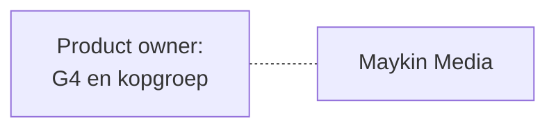
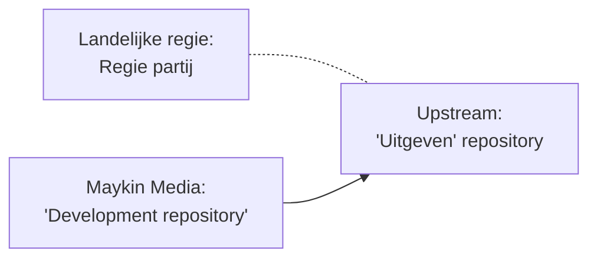

# Stappen voor OpenZaak ecosysteem 

Status: Draft

Dit document bevat mogelijke beoogde stappen die de huidige community leden kunnen maken om regie vanuit landelijke voorziening voor te bereiden.

## Inhoudsopgave
* TOC
{:toc}

## Huidige staat

Een marktpartij die verantwoordelijk is, aangestuurd door de G4

```mermaid
graph LR
    %% Nodes
    Dev1["Maykin Media"]
    PO["Product owner:<br/>G4 en kopgroep"]

    %% Connections
    PO -.- Dev1 
```

## Iteratief te maken stappen

1) Creatie Github organisatie onder beheer van landelijke regie, overdracht van de OpenZaak repository naar deze organisatie

2) Onderhoud contract vanuit landelijke regie om structureel, noodzakelijk werk te borgen 

3) Definitie van verantwoordelijkheden landelijke regie en Maykin Media incl
   1) Website
   2) Niet feature-gerelateerde documentatie
   3) 

4) Nodige aanpassing aan governance file en contracten

Met bij elke stap een kosten/baten analyse en evaluatie

```mermaid
graph LR
    %% Nodes
    Dev1["Maykin Media:<br/>'Development repository'"]
    Upstream["Upstream:<br/>'Uitgeven' repository"]
    PO["Landelijke regie:<br/>Regie partij"]

    %% Connections
    PO -.- Upstream
    Dev1 --> Upstream
```

