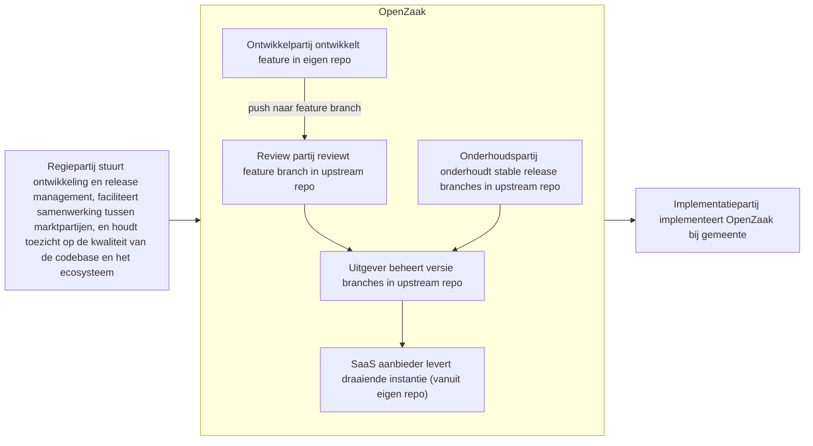
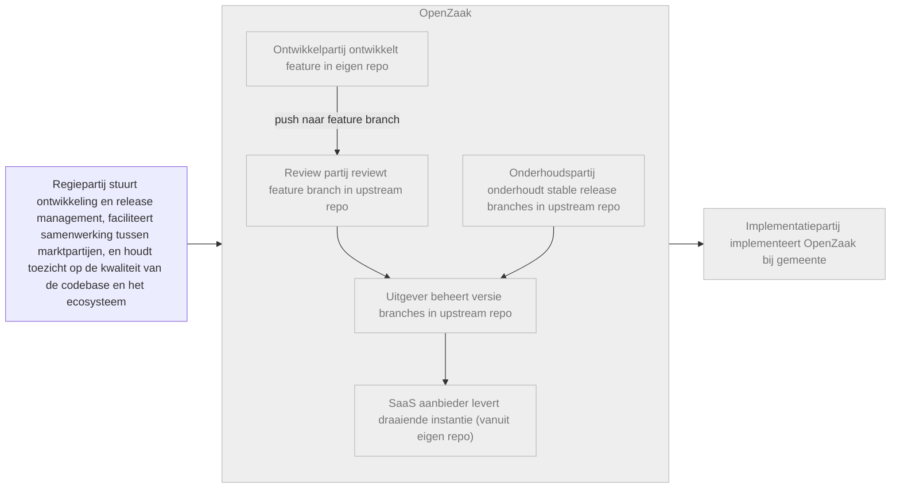
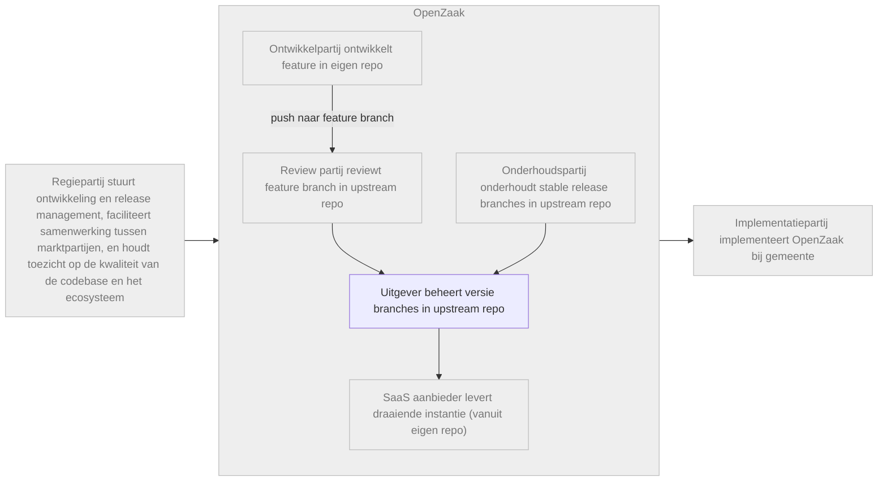
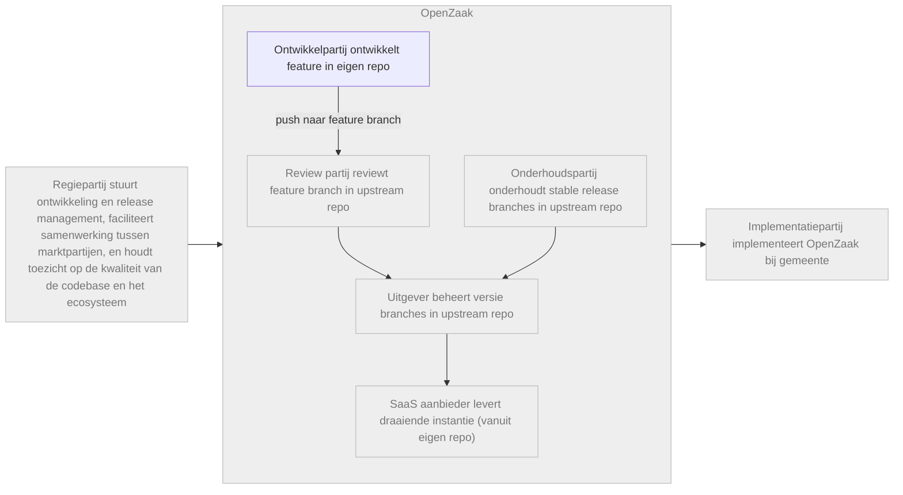
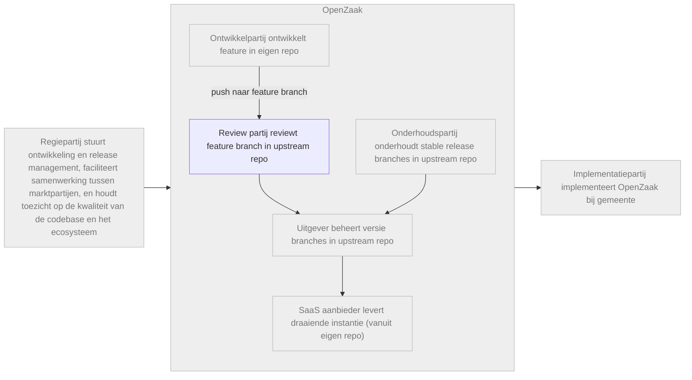
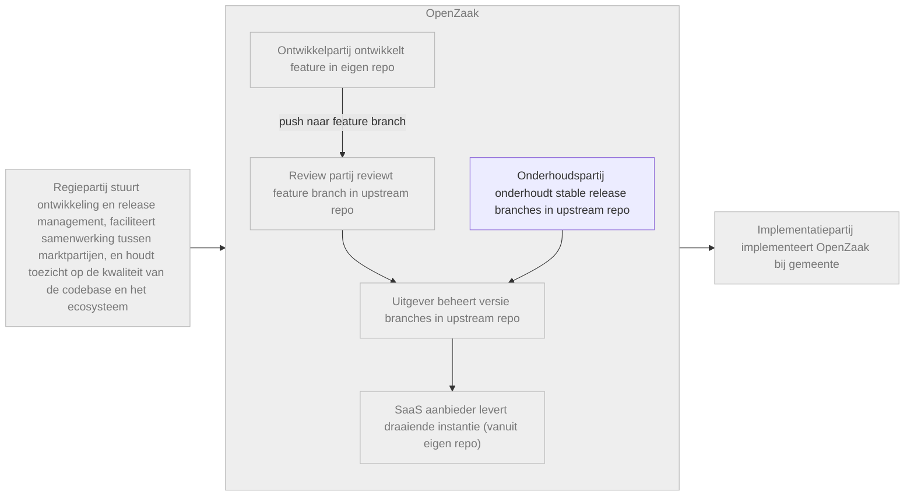
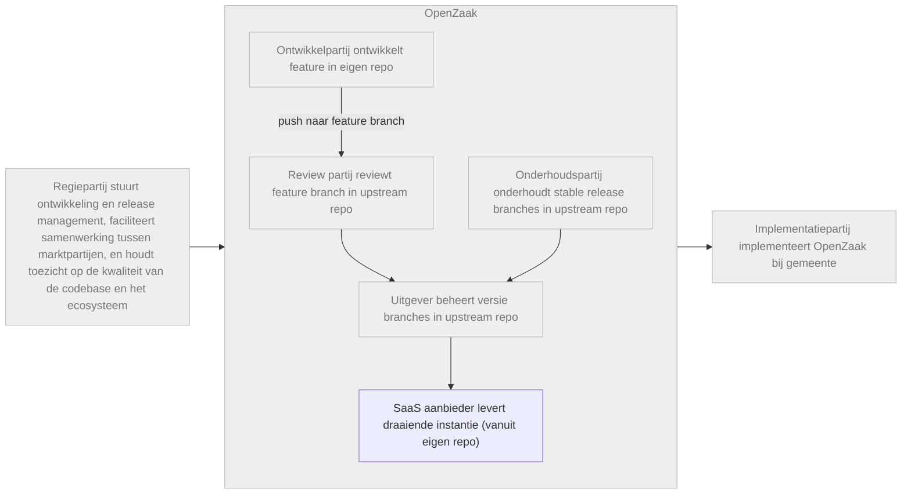
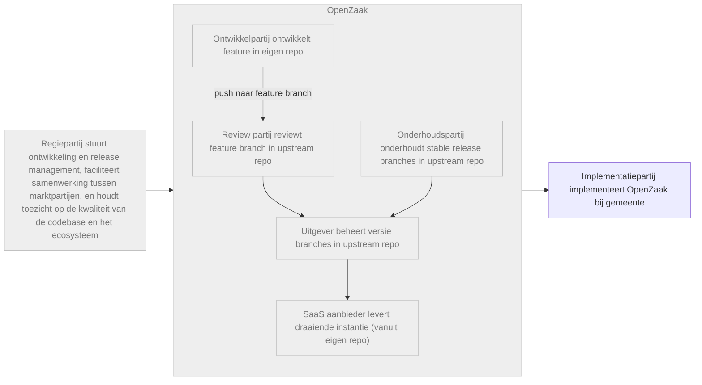

# Rollen voor meerdere marktpartijen

Op basis van de interviews, workshops en bedrijfszekerheidsdoelen, schetst dit document een visie voor de community, de repository-structuur en de relaties tussen marktpartijen.

Het doel is om voor te bereiden dat meerdere marktpartijen kunnen bijdragen, indien en wanneer dit gewenst of vereist is door de G4 en/of landelijke regie.

## Inhoudsopgave
* TOC
{:toc}

## Inleiding: huidige governance- en werkafspraken

De huidige OpenZaak community werkt goed voor snel en informeel werken.

Er is veel informele samenwerking binnen de community, inclusief documentatie met een informeel karakter.
Rollen en verantwoordelijkheden zijn niet altijd duidelijk belegd en meerdere rollen worden door dezelfde partij vervuld, waardoor het niet altijd duidelijk is welke activiteiten en beslissingen onder welke rol vallen.
De G4 vervult een aansturende rol.
Er is veel goodwill en de meeste betrokken partijen zijn tevreden.

Naarmate OpenZaak groeit en breder wordt ingezet, kan de community veranderen.

Gezien de ambitie om van OpenZaak een kerncomponent te maken die op landelijk niveau onder centrale regie wordt geëxploiteerd, kunnen stappen worden gezet om de bedrijfszekerheid van de community te versterken.

## Voorstel: rollen & verantwoordelijkheden

Uit de gesprekken komen een aantal rollen naar voren die we van elkaar kunnen scheiden, om deze in een later stadium aan verschillende marktpartijen te kunnen toewijzen, indien gewenst of vereist, te weten:
- Regiepartij (voorheen Ecosysteem/codebase steward),
- Ontwikkelpartij (voorheen Development),
- Reviewpartij (voorheen Reviewen),
- Uitgever,
- Onderhoudspartij (voorheen Maintenance/onderhoud),
- SaaS aanbieder (voorheen Leveren (SaaS)),
- Implementatiepartij (voorheen Implementeren).

Hieronder lichten we per rol toe wat de rol inhoudt, welke taken daarbij horen, en waarom we deze rol gescheiden hebben van andere rollen.

---

### Regiepartij

Nu: G4 overleg

Toekomst: Intern vanuit landelijke regie, of gedelegeerd

#### Rolbeschrijving

Het ophalen van problemen en wensen met betrekking tot de doorontwikkeling van de component en het coördineren van de doorontwikkeling op basis van de afgesproken governance, om de verschillende belangen in balans te houden: tussen aanbieders en afnemers, en tussen bijv. grote en kleine gemeenten, etc.

#### Taken

- Collectief product ownerschap met duidelijke roadmap, doel & scope, architectuurprincipes, standaarden, lifecycle and compatibility etc.
- Portfolio management over alle componenten heen, inclusief samenhang en configuratie tussen versies daarvan.
- Regie over marktpartijen en samenwerking tussen marktpartijen.
- Community management, inclusief open-source governance, bijdrageprocessen, besluitvorming, rolzuiverheid, kenniscontinuïteit en bedrijfszekerheid.
- Ecosysteem management, inclusief afweging tussen stabiliteit, innovatie, onafhankelijkheid en beheerkosten.
- Financiering en opdrachtgeverschap.

#### Overwegingen

*  Dit is een landschap met meerdere componenten, dus er moet vanuit landelijke regie toezicht zijn op de onderlinge afhankelijkheden tussen de verschillende componenten.

---

### Uitgever

Nu: Maykin

Toekomst: Intern vanuit landelijke regie, of gedelegeerd

#### Rolbeschrijving

Langetermijn beschikbaar stellen van component(versies).
Op orde en compliant houden van de opensourcecode van de component(versies).

#### Taken

- Upstream repository met publicatie en archief van alle (stable) releases van code
- Central issue en bug tracker, acceptatie van feature pull request   
- Product release management met documentatie
  - communicatie van release dates, breaking changes, critical issues
  - change log, dependency graph
  - installatie-, beheers, en gebruiks-handleiding

#### Overwegingen

*  Een centrale repository, in eigendom en beheer van de landelijke regie, met alle (stabiele) versies van alle componenten, maakt beter toezicht en betere regie mogelijk.

---

### Ontwikkelpartij

Nu: Maykin

Toekomst: Mogelijk tweede marktpartij met een feature development contract, indien nodig/gewenst

#### Rolbeschrijving

Projectmatig ontwikkelen van een component of een feature van een component.

#### Taken

- Code contributies (new features of patches) met alle bijhorende documentatie en tests 
- Aanbieden aan beheerder als pull request
- Werkt mogelijk samen met een review party

#### Overwegingen

*  Levering aan de centrale repository, onder toezicht van de steward, maakt een duidelijke definitie van “done” en het beheer van features/versies mogelijk.

---

### Reviewpartij

Nu: Maykin

Toekomst: Mogelijk tweede marktpartij met een review contract

#### Rolbeschrijving

Samenwerken met de development partij door contributies naar de publicatie repo te reviewen. 
Dit in het kader van vier ogen principe én warme kennis bij meer dan één partij.

#### Taken

- Onafhankelijke review (code, security, documentatie, herbruikbaarheid, etc)

#### Overwegingen

*  De introductie van een tweede beoordelingspartij zorgt voor meer veerkracht in het ecosysteem, waarbij een tweede partij over warme kennis van de codebase beschikt.

---

### Onderhoudspartij

Nu: Maykin, als onderdeel van een featurecontract

Toekomst: Maykin met een specifiek onderhoudscontract, mogelijk tweede marktpartij met een specifiek onderhoudscontract

#### Rolbeschrijving

Onderhoud van een of meerdere stable release versies van de code, inclusief bug fixes, updates en security patches. 

#### Taken

- Monitoren van stable releases op bugs, security en performance issues.
- Uitvoeren van bug fixes, updates en security patches.
- Communiceren van onderhoudsactiviteiten naar relevante stakeholders.

#### Overwegingen

*  Indien gewenst, zou de tweede beoordelingspartij op termijn ook het beheer van de codebase kunnen doen (bijvoorbeeld bij elke andere stabiele release) om zo nog meer kennis van de codebase op te bouwen.

---

### SaaS aanbieder

Nu: Verschillende SaaS aanbieders

Toekomst: centrale SaaS aanbieder onder landelijke regie

#### Rolbeschrijving

Het leveren van stable versie(s) uit de publicatie repositorie als een draaiende instantie van de component.

#### Taken

- Levert eindproducten als SaaS-dienst.
- Verantwoordelijkheid voor performance, schaalbaarheid, capaciteit van de diensten.
- Monitoring, incidentmanagement, back-ups, herstel en dagelijkse operationele beveiliging.
- Inbrengen bugs, issues, requirements terug naar de centrale issue tracker.

#### Overwegingen

* Een aparte SaaS-aanbieder om de kwaliteit van de codebase, de uitvoerbaarheid door andere partijen, en daarmee de veerkracht van het ecosysteem te waarborgen.

---

### Implementatiepartij

#### Rolbeschrijving

Het inrichten van de instantie van de component voor specifiek gebruik bij een gemeente, het trainen van medewerkers en het beantwoorden van vragen.

#### Taken
 
- Aanpassen van werkprocessen, configuraties en werkwijzen zodat de SaaS-diensten aansluiten op de dagelijkse praktijk.
- Brengen ervaringen, knelpunten en behoeften van gebruikers terug naar het ecosysteem ter verbetering van productdefinitie, adoptie en dienstverlening.
