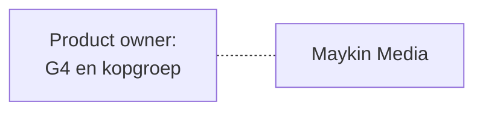
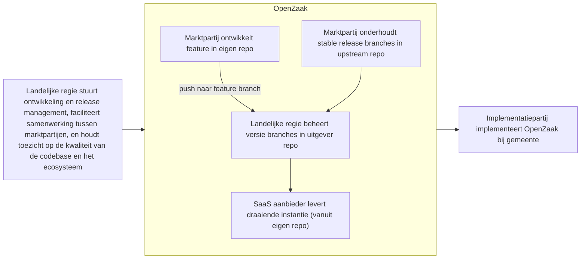

# Stappen voor OpenZaak ecosysteem 

Status: Draft

Dit document bevat mogelijke beoogde stappen die de huidige community leden kunnen maken om regie vanuit landelijke voorziening voor te bereiden.

## Inhoudsopgave
* TOC
{:toc}

## Huidige staat

Een marktpartij die verantwoordelijk is, aangestuurd door de G4

## Beoogde staat

Een marktpartij die verantwoordelijk is, aangestuurd door de landeljike regie, met een landelijke-gestuurde SaaS aanbieder, en locale implementatiepartijen. 

## Te maken stappen

1) Proof of concept pilot om `uitgever` en `onderhoud` rollen uit te werken  
2) Opzetten van VNG repo (downstream) om process & kosten in kaart te brengen (bvb infra) en `regie` rol verder uit te werken  
3) Uitgewerkt model delen met community voor feedback, en dan verwerken tot inkoopcontracten en een aanbesteding  

## Proof of concept pilot `uitgever` en `onderhoud` rollen

### Doel proof of concept pilot 

Contract vanuit landelijke regie om binnen de huidge werkwijze de `uitgever` en `onderhoud` rollen in te brengen, incl:
   * apparte mensen en uren registratie om processfrictie en kosten in kaart te brengen
   * iteratief verbeteren op voorstel `uitgever` en `onderhoud` (bvb taken verschuiven, toevoegen verwijderen)
   * bijhouden inzichten wanneer test scenarios voorkomen in de praktijk
   * bijhouden welke bijkomende verantwoordelijkheden van `regie` verwacht worden

### Test scenarios

Prioriteit:  

1) Ontiwkkelen van een nieuwe feature  
2) Security report via de github repo  
3) Patch release met bug fixes  
4) Pull request van buitenaf  
   
Later uit te werken:  

1) Feature release (major and minor)  
2) Nieuwe versie van de VNG standaard  
3) Dependabot issue gemaakt van common vulnerability exploit (automatic)  
4) Wens vanuit andere overheidsorgaan (bvb Logius)  
5) Wens vanuit andere gemeente voor locaal versnellen  
6) Wens vanuit de regie organisatie  
7)  Bug/issue reported op de github  
8)  Security release  
9)  Issue vanuit test suite voor dependencies tussen componenten

#### Ontiwkkelen van een nieuwe feature

| Stap | Regie | Uitgever | Onderhoud |
|------|-------|----------|-----------|
| 1 | stelt financiering en opdracht beschikbaar; keurt feature goed voor roadmap en bewaakt scope en architectuurprincipes | — | — |
| 2 | valideert architecturale conformiteit van de feature tijdens het ontwikkelproces | — | — |
| 3 | — | — | beoordeelt impact op bestaande stable releases en backwards compatibiliteit |
| 4 | — | accepteert en reviewt pull request op kwaliteit, veiligheid, herbruikbaarheid en architecturale fit | — |
| 5 | — | verwerkt goedgekeurde feature in een nieuwe versietak; past versiebeheer toe | — |
| 6 | — | publiceert release-notes en communiceert release naar mailinglijst | — |
| 7 | — | werkt documentatie en compatibiliteitsmatrix bij | — |
| 8 | — | — | beoordeelt de nieuwe feature expliciet op beheerbaarheid, onderhoudbaarheid en overdraagbaarheid voordat structureel beheer wordt aanvaard |
| 9 | — | — | rolt CI pipeline en geautomatiseerde testen uit op nieuwe release; lost eventuele regressions op |

#### Security report via de github repo

| Stap | Regie | Uitgever | Onderhoud |
|------|-------|----------|-----------|
| 1 | — | ontvangt melding via responsible disclosure e-mailadres of issue tracker | — |
| 2 | wordt geïnformeerd over ernst en scope; is eindverantwoordelijk voor naleving van het disclosure beleid | — | voert dagelijkse beveiligingsscan uit; identificeert of bevestigt het probleem |
| 3 | beslist over prioriteit en urgentie in overleg met uitgever en onderhoud; escaleert indien nodig conform security- en compliancekaders | — | — |
| 4 | — | — | valideert en reproduceert het beveiligingsprobleem; beoordeelt prioriteit |
| 5 | — | — | ontwikkelt en test de security patch |
| 6 | — | — | levert patch aan als pull request aan de uitgever |
| 7 | — | reviewt en accepteert de patch; verwerkt in een patch release | — |
| 8 | wordt geïnformeerd over CVE publicatie; keurt communicatie goed conform disclosure beleid | publiceert CVE; communiceert security release naar mailinglijst en relevante stakeholders | — |
| 9 | — | archiveert de gepatchte release in de centrale repository | — |
| 10 | — | — | monitort stable releases na de patch op eventuele verdere issues |

#### Patch release met bug fixes

| Stap | Regie | Uitgever | Onderhoud |
|------|-------|----------|-----------|
| 1 | — | — | monitort stable releases op bugs, security en performance issues |
| 2 | — | — | valideert gerapporteerde bugs en beoordeelt prioriteit |
| 3 | wordt geïnformeerd over prioriteit en scope van de patch | — | — |
| 4 | — | — | ontwikkelt en test bug fixes binnen de stable release branch |
| 5 | — | — | levert patch aan als pull request aan de uitgever |
| 6 | — | reviewt en accepteert de patch op kwaliteit, veiligheid en backwards compatibiliteit | — |
| 7 | — | verwerkt goedgekeurde patch in een nieuwe patch release; past versiebeheer toe | — |
| 8 | — | publiceert release-notes en communiceert patch release naar mailinglijst | — |
| 9 | — | archiveert de gepatchte release in de centrale repository | — |

#### Pull request van buitenaf

| Stap | Regie | Uitgever | Onderhoud |
|------|-------|----------|-----------|
| 1 | — | ontvangt pull request via de openbare issue tracker of repository | — |
| 2 | — | toetst of de bijdrage voldoet aan de contributierichtlijnen en EUPL licentievoorwaarden | — |
| 3 | — | monitort pull request op kwaliteit, veiligheid, herbruikbaarheid en architecturale fit | — |
| 4 | — | — | beoordeelt impact op bestaande stable releases en backwards compatibiliteit |
| 5 | wordt geconsulteerd indien de bijdrage raakt aan roadmap, scope of architectuurprincipes | — | — |
| 6 | — | geeft feedback aan de externe bijdrager en begeleidt het iteratieproces | — |
| 7 | — | accepteert en verwerkt goedgekeurde bijdrage in de relevante versietak | — |
| 8 | — | werkt documentatie en release-notes bij | — |
| 9 | — | — | beoordeelt de bijdrage op beheerbaarheid en onderhoudbaarheid voordat structureel beheer wordt aanvaard |
| 10 | — | — | rolt CI pipeline en geautomatiseerde testen uit op de bijgewerkte codebase |

## Opzeteten VNG repo

## Inkoopcontracten en aanbesteding 

Raamwerk Collectieve Inkoop OSS versie 03
Voorbeeld Offerte aanvraag MVO Kavel Beheren versie 0.92
Voorbeeld Overeenkomst Kavel Beheren Versie 0.92
Voorbeeld SLA Kavel Beheren Broncode Versie 0.92

### Raamwerk Collectieve Inkoop OSS versie 03

### Voorbeeld Offerte aanvraag MVO Kavel Beheren versie 0.92

2 Omschrijving van de opdracht

De gemeente <Naam gemeente> heeft besloten om de open source applicatie <naam applicatie> in
gebruik te gaan nemen en wenst een marktpartij te selecteren die het broncode beheer gaat
verzorgen.

Dit betekent dat de gemeente het beheer van de broncode wil laten uitvoeren door een te selecteren
marktpartij die minimaal een keer per jaar een grote release wil doorvoeren en twee keer per jaar
een minor release. Indien nodig dient op afroep een tussentijdse release te worden uitgerold.
Voor broncode beheer zijn kwaliteitscriteria opgesteld. Broncode beheer dient te voldoen aan deze
kwaliteitscriteria. Zie bijlage “Basisset 1.0”1, kolom ‘broncode beheer’.

2.1 De opdracht
De opdracht bestaat uit
• Beheer van broncode, gericht op de instandhouding van de kwaliteit en technische
doorontwikkeling van het product.
• Het leveren van hoofdmaintainer diensten, met andere woorden het invullen van de
codebase stewardrol.
De opdracht omvat het onderhoud van de broncode van <naam applicatie><verwijzing git bron>
zodanig dat de oplossing met voldoende bedrijfszekerheid binnen het ecosysteem van een gemeente
in gebruik kan worden genomen en de bedrijfszekere werking van de broncode gedurende de looptijd
van de overeenkomst is gegarandeerd.
   
5.2.1 Gunningscriterium: Beheer
Opdrachtgever wenst een partner te selecteren die haar volledig ontzorgt bij het broncode beheer.
Beschrijf op het gebied van beheerwerkzaamheden:
• Hoe kwaliteit van de broncode wordt geborgd?
• Welke activiteiten worden ondernomen?
• Hoe releasemanagement en -planning worden georganiseerd?

5.2.2 Gunningscriterium : Service Level Agreement (SLA):
Beantwoord dit gunningscriterium met uw Service Level Agreement (SLA). In de SLA dient
aangegeven te worden op welke wijze hoofdmaintainer diensten worden geleverd.

### Voorbeeld Overeenkomst Kavel Beheren Versie 0.92

Artikel 2. Dienstverlening
1. <Leverancier> verzorgt het beheer op volgende diensten en/of applicaties:
a. <Omschrijving dienstverlening beheer>.
• Beheer van broncode, gericht op de instandhouding van de kwaliteit en
technische doorontwikkeling van het product,
▪ Het leveren van hoofdbeheerder diensten
b. <Omschrijving applicatie waar beheer op wordt uitgevoerd> In casu: Open Formulieren

### Voorbeeld SLA Kavel Beheren Broncode Versie 0.92

1 Definities
Broncode beheer
Beheer van broncode wordt als volgt gedefinieerd: de instandhouding van de kwaliteit en technische
doorontwikkeling van het product.

2.2 Open source
Open Formulieren is open source product. Om een open source product succesvol te gebruiken,
moet het product kwalitatief goed zijn en blijven. Hiervoor is beheer van broncode nodig. Dit wordt
gedaan door de hoofdbeheerder. In deze SLA is aangegeven hoe de hoofdbeheerder hiervoor zorgt.

2.5 Governance
Voor het product bestaat een stuurgroep, bestaande uit afgevaardigden van partijen die financieel
bijdragen aan de open source ontwikkeling. De groep bepaalt de ontwikkelrichting. De afspraken
over governance en financiering zijn opgenomen in een convenant. Meer hierover is te vinden in de
bijlage (later toevoegen).

2.6 Documentatie
De leverancier biedt actuele documentatie t.b.v. installatie, (eind)gebruik, beheer over de software
aan. De documentatie is open source en wordt publiek aangeboden.

3 Diensten

3.1.
Hoofdbeheerder
Hoofdbeheerder zegt toe om:
• leiding te geven aan het broncodebeheer van het product,
• zorg te dragen voor de beschikbaarheid van de broncode en artefacten (momenteel op
Github en DockerHub),
• relevante documentatie bij te houden,
• openbaar beschikbaar te maken,
• contributies aan de open source codebase te verwelkomen,
• contributies (“pull requests”) te monitoren op kwaliteit, veiligheid, herbruikbaarheid en ar-
chitecturale fit,
• contributie richtlijnen op te stellen en te onderhouden,
• ervoor te zorgen dat alle bijdragen voldoen aan de licentievoorwaarden van de Europese
Unie Publieke Licentie (EUPL) versie 1.2 of hoger,
• een openbare issue-tracker bij te houden die suggesties van iedereen accepteert,
• een responsible disclosure programma te onderhouden, inclusief een e-mailadres voor be-
veiligingsproblemen,
• een versie controlemechanisme voor productcode te onderhouden,
• versiebeheer toe te passen,
• openbaar beschikbare release-notes bij te houden om gebruikers te helpen bij het upgraden,
openbare mailinglijst bij te houden waarop gebruikers geïnformeerd worden over releases
en relevant nieuws rondom het codebeheer van product,
• te streven naar backwards compatibiliteit in kleine releases en daarmee installatie/imple-
mentatie-upgrades vereenvoudigen,
• een compatibiliteitsmatrix bij te houden om Devops en implementatie ontwikkelaars te on-
dersteunen bij hun werk,
• nieuwe gebruikers op weg te helpen door gemakkelijk toegankelijke, eenvoudig te gebruiken
voorbeelden beschikbaar te hebben, een CI pipeline te onderhouden, inclusief geautomati-
seerd testen,
• geschikte Helm charts te publiceren voor het product,
• gebruikte componenten van derden ('afhankelijkheden') te beoordelen op kwaliteit,
• veiligheid, volwassenheid en naleving van de open source-licenties,
• actief mee te werken om het product compliant te maken en houden met de relevante en
toepasselijke standaarden,
• het ‘VNG groeipact’ te onderschrijven en bij te dragen bij aan verbeteringen van VNG-stan-
daarden.
Verantwoordelijkheden
Hoofdbeheerder zal:
1. het product en/of onderdelen daarvan niet vervangen, beëindigen of stopzetten, behalve
zoals uiteengezet in Bijlage (Ondersteuningsbeleid voor Versiebeheer van Open Source Soft-
ware ).
2. alles in het werk stellen, in het geval van licenties of rechten op Intellectueel Eigendom van
derden, Intellectuele Eigendomsrechten, Technologie of Open-Source Software, om derge-
lijke Rechten van Derden na te leven.
3. een formeel beveiligingsprogramma te gebruiken en maatregelen te treffen en te handha-
ven die zijn ontworpen om bedreigingen of veiligheidsrisico's, ongeoorloofd, onopzettelijk of
onwettig verlies van, toegang tot of openbaarmaking van gegevens die zijn opgeslagen in het
IB-product te beschermen en te voorkomen. Een dergelijk beveiligingsprogramma voldoet
aan ISO 27001 of een opvolger (indien van toepassing) dat substantieel gelijkwaardig is en
gevalideerd is door onafhankelijke auditors.
4. onmiddellijk eventuele beveiligings-, veiligheids-, gegevensbeschermings- of gegevenspriva-
cykwesties in het product aanpakken als zij zich bewust wordt van een dergelijk probleem en
de klant hiervan gelijktijdig op de hoogte stellen.
5. De Opdrachtgever begrijpt en stemt ermee in:
a. Hoofdbeheerder kan het product updaten, upgraden en onderhouden in de normale
gang van zaken door middel van releases zonder de functionaliteit en/of beveili-
gingsfuncties te verminderen. Als de release een ingrijpende wijziging veroorzaakt,
raadpleeg dan Bijlage (Ondersteuningsbeleid voor Versiebeheer van Open Source
Software) voor het relevante beleid hierin.
b. dat het product niet zal worden gebruikt voor de bediening en/of controle van of
gebruik binnen een High-Risk-systeem als de werking van een dergelijk High-Risk-
systeem afhankelijk is van het product.
c. dat zij het risico dragen van het selecteren van de juiste bedieningsmodus, beschik-
baarheid en beveiligingsopties voor het product, evenals de parametrisering, confi-
guratie en gebruik van dergelijke diensten in het product, tenzij anders overeenge-
komen tussen de partijen.

3.3
Kwaliteitscriteria
Voor broncode beheer zijn kwaliteitscriteria opgesteld. Broncode beheer dient te voldoen aan deze
kwaliteitscriteria. Hiervoor is een eerste opzet gemaakt. Zie bijlage “Basisset 1.0” 1, kolom ‘broncode
beheer’.
De eisen voor broncodebeheer zijn sterk afhankelijk van de opgeleverde software voor een product
(common ground component). De primaire verantwoordelijkheid voor het voldoen aan de non-functionals ligt grotendeels bij de initiële ontwikkelaar van software. De eisen zijn voor de
volledigheid wel aangegeven in de basisset.
Er vindt periodiek (tenminste één keer per kwartaal) een kwaliteitsgesprek plaats, met onder andere
als onderwerpen: sluit opdracht nog aan, hoe is de voortgang van de opdracht, hoe staat het ervoor
met kwaliteit van software etc.?