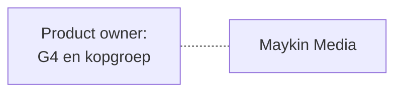
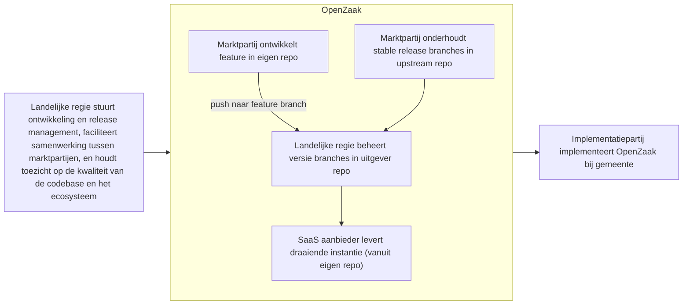

# Stappen voor OpenZaak ecosysteem 

Status: Draft

Dit document bevat vervolg stappen die de huidige community leden kunnen maken om regie vanuit landelijke voorziening voor te bereiden.

## Inhoudsopgave
* TOC
{:toc}

## Huidige staat

Een marktpartij die verantwoordelijk is, aangestuurd door de G4



## Beoogde staat

Een marktpartij die verantwoordelijk is, aangestuurd door de landeljike regie, met een landelijke-gestuurde SaaS aanbieder, en locale implementatiepartijen. 



## Te maken stappen

1) Proof of concept pilot om `uitgever` en `onderhoud` rollen uit te werken  
2) Opzetten van VNG repo (downstream) om process & kosten in kaart te brengen (bvb infra) en `regie` rol verder uit te werken  
3) Uitgewerkt model delen met community voor feedback, en dan verwerken tot inkoopcontracten en een aanbesteding  

## Proof of concept pilot `uitgever` en `onderhoud` rollen

### Doel proof of concept pilot 

Aanpaste contract texten voor `uitgever` en `onderhoud` rollen (zie Resultaten) te toetsen en verbeteren door deze rollen in te brengen in de huidige werkwijze, incl: 
   * apparte mensen en uren registratie om processfrictie en kosten in kaart te brengen
   * iteratief verbeteren op voorstel `uitgever` en `onderhoud` (bvb taken verschuiven, toevoegen verwijderen)
   * bijhouden inzichten wanneer test scenarios voorkomen in de praktijk
   * bijhouden welke bijkomende verantwoordelijkheden van `regie` verwacht worden

## Opzeteten VNG repo en `regie` rol

### Beschrijving regie rol

Als regie ben je eindverantwoordelijk voor de richting, kwaliteit en continuïteit van het product en het ecosysteem daaromheen.

Dat vraagt om actief community stewardship: je maakt governance-processen transparant, zorgt dat deelname aan het ecosysteem toegankelijk is voor nieuwe partijen, en bewaakt dat publieke waarden — zoals openheid, herbruikbaarheid en leveranciersonafhankelijkheid — geborgd blijven.

Je stelt kaders en zorgt dat alle betrokken partijen hun rol effectief kunnen vervullen.

Je overziet:
* de roadmap, scope en architectuurprincipes van het product
* de financiering en het opdrachtgeverschap voor de andere rollen binnen het ecosysteem
* de administratie van de centrale repository (incl toegangsrechten) en bijbehorende infrastructuur 
* de samenhang tussen componenten binnen het bredere Common Ground landschap
* de onafhankelijke toetsing van kwaliteit, governance en publieke waarden
* de borging van security-eisen, privacy-kaders en wettelijke compliance

Je bent niet verantwoordelijk voor de dagelijkse uitvoering van uitgeven of onderhoud — die rollen beleg je bij anderen.

Je draagt wel eindverantwoordelijkheid voor het geheel: je bewaakt of het systeem als zodanig functioneert, stuurt bij waar nodig, en zorgt voor kenniscontinuïteit en bedrijfszekerheid binnen de community.

### Werkafspraken (voorbeeld) 

Vanuit Informatieblad bijdragen voor broncodebeheer 2026:

```
1) invulling geven aan het team dat de werkzaamheden uitvoert,  
24) minimaal eenmaal per jaar een bijeenkomst te organiseren voor alle broncodebeheerpartners die meedoen aan het broncodebeheer voor het product,
```

Bijkomende:

```
* Beschikbaar stellen van financiering en opdrachtgeverschap voor de uitgever- en onderhoudsrol,  
* Bewaken van de roadmap, scope en architectuurprincipes van het product,  
* Coördineren van de samenhang tussen componenten binnen het Common Ground landschap,  
* Faciliteren van samenwerking tussen marktpartijen die bijdragen aan het ecosysteem,  
* Toezicht houden op de kwaliteit van de codebase en het ecosysteem,  
* Borgen van kenniscontinuïteit en bedrijfszekerheid binnen de community,  
* Beheren van de centrale upstream repository onder landelijke regie,  
* Beschikbaar stellen en onderhouden van de benodigde infrastructuur voor de centrale repository,  
* Beheren van toegangsrechten en permissies op de centrale repository,  
* Zorgen voor de continuïteit en beschikbaarheid van de centrale repository en bijbehorende infrastructuur,  
* Minimaal eenmaal per jaar een bijeenkomst organiseren voor alle partners die meedoen aan het product,  
* Onafhankelijke toetsing organiseren op kwaliteit, werking, governance en publieke waarden op zowel component- als ecosysteemniveau, en zorgen dat bevindingen worden opgevolgd,  
* Security-eisen, privacy-kaders en wettelijke compliance definiëren en handhaven, en borgen dat deze consistent worden toegepast door alle partijen,  
* Beleid vaststellen voor versieondersteuning, backwards compatibiliteit en end-of-life, inclusief afweging tussen stabiliteit, innovatie en beheerkosten,tibiliteit en end-of-life, inclusief afweging tussen stabiliteit, innovatie en beheerkosten,  
```
